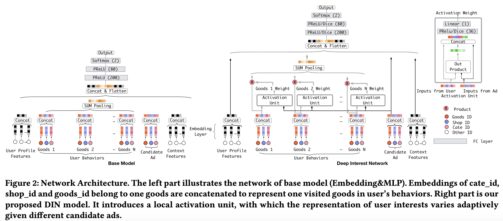
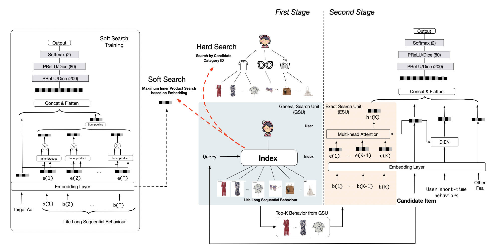

# OKX 推荐算法工程师 · 专项面试准备

> **对标岗位**：Principal / Senior Staff Algorithm Engineer, Search & Recommendation  
> **参考 JD**：要求 8 年+ 经验，5 年+ 推荐/搜索，DAU 1000 万+ 在线系统全链路经验  
> **技术重心**：Transformer 序列排序 → 生成式推荐 → LLM Agent 意图理解  
> **当前匹配度评估**：55–65%，主要短板在生成式推荐（FSQ/RQ-VAE）、Uplift 因果推断、大规模分布式训练

---

## 目录

| #　　| 模块　　　　　　　　　　　　　　　　　　　　　　　　　　　　| 对标 JD 核心技能　　　　　　　　　　　　　　　　　　　　　　|
| ------| -------------------------------------------------------------| -------------------------------------------------------------|
| 一　 | [用户行为序列建模](#一用户行为序列建模)　　　　　　　　　　 | DIN → SIM → HSTU（HSTU 非生成式，是排序打分模型），位置编码 |
| 二　 | [多任务学习](#二多任务学习)　　　　　　　　　　　　　　　　 | MMoE / PLE / ESMM / **DCN v1/v2**，梯度冲突　　　　　　　　 |
| 三　 | [Listwise 排序损失](#三listwise-排序损失)　　　　　　　　　 | ListMLE, Softmax Loss, LambdaRank　　　　　　　　　　　　　 |
| 四　 | [因果推断与偏差校正](#四因果推断与偏差校正)　　　　　　　　 | Uplift Modeling, Position Bias, Selection Bias　　　　　　　|
| 五　 | [生成式推荐](#五生成式推荐)　　　　　　　　　　　　　　　　 | FSQ / RQ-VAE，序列生成，偏好对齐　　　　　　　　　　　　　　|
| 六　 | [用户意图与画像体系](#六用户意图与画像体系)　　　　　　　　 | 跨域意图框架，冷启动→稳定偏好全生命周期　　　　　　　　　　 |
| 七　 | [LLM Agent 与推荐融合](#七llm-agent-与推荐融合)　　　　　　 | ReAct, Tool-Use, 被动推送→主动意图满足　　　　　　　　　　　|
| 八　 | [OKX 业务场景特有问题](#八okx-业务场景特有问题)　　　　　　 | Web3 / DeFi 推荐，加密用户行为　　　　　　　　　　　　　　　|
| 九　 | [工程与系统设计](#九工程与系统设计)　　　　　　　　　　　　 | Flink/Kafka 实时特征，推理优化，延迟 SLA　　　　　　　　　　|
| 十　 | [高频手撕代码题](#十高频手撕代码题)　　　　　　　　　　　　 | 注意力、序列建模、VQ 量化等　　　　　　　　　　　　　　　　 |
| 十一 | [行为问题与系统设计面试](#十一行为问题与系统设计面试)　　　 | 结构化叙述，STAR 框架　　　　　　　　　　　　　　　　　　　 |
| -　　| [高频技术问答](#高频技术问答序列建模--特征交叉--生成式推荐) | SIM/HSTU/DCN/Transformer 常见追问　　　　　　　　　　　　　 |

---

## 一、用户行为序列建模

### 背景

从 User-CF 到 MF 到 DNN，推荐系统的核心演进是**如何表达用户的兴趣**。用户的历史行为序列（点击、观看、交易）包含丰富的时序信号，如何从中提取出"此时此刻，这个用户对这类候选的偏好"是排序模型的核心问题。

---

### 1.1 DIN（Deep Interest Network）

**论文**：[DIN: Deep Interest Network for Click-Through Rate Prediction](https://arxiv.org/abs/1706.06978)，阿里巴巴，2018，KDD

**核心思想**：用户历史行为对不同候选 item 的贡献权重不同，不应该把所有历史行为等权平均 Pooling。DIN 引入**注意力机制**，动态计算用户历史中每条行为与当前候选的相关性。

**架构**：


```
候选 Item 特征 ─────────────────────────────────────────┐
                                                        │
用户历史行为序列 [e_1, e_2, ..., e_n]                    │
    │                                                   │
    └──→ Activation Unit(e_i, candidate) ──→ softmax权重 a_i
                                                        │
    加权和 = Σ a_i * e_i  ────────────────────────────┐ │
                                                      ↓ ↓
                                             Concat → DNN → sigmoid → pCTR
```

**Activation Unit** 的计算：

```python
# 候选 item embedding: e_a, 历史行为 embedding: e_i
score = MLP([e_i, e_a, e_i - e_a, e_i * e_a])  # 四路拼接
weight = softmax(score)
user_interest = sum(weight_i * e_i for e_i in history)
```

**DICE 激活函数**：DIN 提出用 DICE 替代 PReLU，数据自适应地决定激活点：
- `f(x) = p(x) * x + (1 - p(x)) * α * x`，其中 `p(x) = sigmoid((x - E[x]) / sqrt(Var[x] + ε))`
- 直觉：均值附近的输入更需要非线性，DICE 自动学习这个转折点

**正则化**：DIN 提出 **Mini-batch Aware Regularization（MBA）**：只对当前 batch 出现过的参数计算 L2 正则，避免对稀疏特征的过度惩罚，显著减少大规模 embedding table 的正则化开销。

**局限性**：序列长度受限（通常 50 以内），无法捕捉长期兴趣，也没有时序位置信息。

---

### 1.2 SIM（Search-based Interest Model）

**论文**：[SIM: Search-based User Interest Modeling with Lifelong Sequential Behavior Data](https://arxiv.org/abs/2006.05639)，阿里巴巴，2020，CIKM

**核心动机**：DIN 只能处理最近 50-200 条行为，而真实用户 180 天内可有约 54000 条。SIM 用两阶段方法让模型能利用全量长期历史。

**双路架构**：GSU→ESU 处理长期兴趣（180 天），DIEN 并行处理短期兴趣（~14 天），拼接后进 MLP。



```
全量历史（180天, ~54000条） → GSU → Top-200 → ESU → u_long ↘
                                                          concat → MLP → pCTR
近期行为（14天, ~50条）     → DIEN                → u_short ↗
```

#### GSU — 粗筛（二选一，不是拼接）

联合 loss `L = α·L_GSU + β·L_ESU`，Hard Search 时 α=0（无参数），Soft Search 时 α=1。

**Hard Search**：按候选 item 的 category_id 从用户历史的倒排索引中直接查表取同类目行为，截断到 K=200。业界部署更广泛，工程简单、效果够用。

**Soft Search**：用独立辅助 CTR 模型在长序列上训练 item embedding（不能用 ESU 的 embedding，长短序列分布不一致），离线建 per-user ANN 索引，在线用候选 embedding 做 MIPS 检索 Top-K。

#### ESU — Multi-Head Target Attention

**不是** Self-Attention（K×K），**不是**标准 Cross-Attention（序列对序列）。是 **Target Attention**：Q 是候选 item 单个向量，K/V 来自行为序列，注意力形状 **(1 × K)**。

```python
z_i = concat(e_behavior_i, time_embedding_i)   # 行为表示拼接时间编码

# 每个头 h:
Q_h = W_q_h · e_candidate     # (d_k,)   ← 单个向量
K_h = W_k_h · z_i             # (K, d_k)
V_h = W_v_h · z_i             # (K, d_v)
α = softmax(Q_h · K_h^T / √d_k)  # (K,)  ← K 个权重
head_h = Σ αᵢ · V_h_i             # (d_v,)

output = W_o · concat(head_1, ..., head_H)  # 用户长期兴趣向量
```

**与 DIN 的关系**：ESU 就是 DIN Activation Unit 的多头升级——DIN 用 MLP 打分（单视角），ESU 用 scaled dot-product + 多头（多视角）+ 时间编码。

**时间编码**：`time_bucket = floor(log(Δdays + 1))`，对数分桶使近期分辨率高、远期粗糙，拼接到行为 embedding 上参与 attention 计算。

---

### 1.3 HSTU（Hierarchical Sequential Transduction Units）

**论文**：[Actions Speak Louder than Words: Trillion-Parameter Sequential Transducers for Generative Recommendations](https://arxiv.org/abs/2402.17152)，Meta，2024，ICML

**定位**：HSTU 是一个魔改版 Transformer 架构，用于将推荐问题统一为自回归序列预测任务。可同时用于召回（输出用户表示 → ANN 检索）和排序（输出相关性分数）。

#### 核心思想：把一切拍平成一条序列

传统 DLRM 有多套异构特征（sparse embedding + dense feature + 序列特征），各自独立处理再交叉。HSTU 把所有特征序列化为统一时间线：

```
[user_profile] [点击_itemA_周一] [购买_itemB_周二] [浏览_itemC_周三] → 预测下一个行为
     ↑              ↑                ↑                ↑
  用户属性token    行为token        行为token        行为token
```

每个 token = 行为类型 + item 特征 + 时间戳。自回归训练（causal mask），每个位置预测下一个 token，一条序列产出 N-1 个训练样本。

#### HSTU Block 架构（对标准 Transformer 的三处改动）

每层三个子层：

```
Eq1  Pointwise Projection:    U, V, Q, K = Split(SiLU(W₁·X))
Eq2  Spatial Aggregation:     A·V = SiLU(Q·K^T + rab^{p,t}) · V / N
Eq3  Pointwise Transformation: Y = W₂(Norm(A·V) ⊙ U)
```

**改动 1：去掉 softmax，用 SiLU 逐点激活**

```
标准 Transformer: softmax(QK^T/√d) · V      ← 归一化，所有权重和=1
HSTU:            SiLU(QK^T + rab) · V / N    ← 逐点激活，除以 token 数 N
```

softmax 丢失"强度"信息：点过 100 个键盘 vs 3 个键盘，softmax 归一化后权重占比接近，但 100 vs 3 的强度信号被抹掉了。推荐需要预测参与强度（如停留时长），SiLU 逐点激活保留绝对强度。

**改动 2：用门控（gating）替代 FFN**

标准 Transformer：Self-Attention → FFN（两层线性+激活）。HSTU 砍掉 FFN，换成 `Norm(A·V) ⊙ U`。U 是从输入多投影出的第四个向量，⊙ 逐元素乘法做门控——U 决定哪些维度放行/抑制，类似 SwiGLU。效果：6 个线性层压缩到 2 个（W₁ 和 W₂），显存减半。

**改动 3：相对注意力偏置 rab（同时编码位置和时间）**

`rab^{p,t}` 加在 Q·K^T 上，同时编码位置距离和时间间隔，不需要单独的 PE。论文提到的一种实现：对时间差 (tⱼ-tᵢ) 做分桶后查 learned bias table。

**"Hierarchical" 指什么**：不是显式的 session 切分，而是多层 HSTU block 堆叠逐层提取不同粒度特征（底层 item 级交互，高层抽象兴趣模式），配合高层 K/V 下采样和 Stochastic Length 训练时随机截断增加稀疏性。

#### HSTU 替代了 DLRM 的整条流水线

```
DLRM:  特征提取(embedding) → 特征交叉(DCN/FM) → 表示变换(MLP)   三段式
HSTU:  Self-Attention(特征提取) → ⊙U(特征交叉/门控) → 多层堆叠(表示变换)  统一
```

#### 行为 vs 语言的三大差异

| 差异 | 语言 | 行为 | HSTU 解法 |
|------|------|------|-----------|
| 词表规模 | 3-5 万 | 百亿级 item ID | 不查 embedding 表，用 item 特征乘投影矩阵 |
| 信号质量 | token 标签明确 | 点击≠偏好（误点、位置偏差） | 多信号联合监督（曝光/点击/停留/购买各自加权） |
| 序列规律 | 有语法约束 | 意图随时漂移 | 多层堆叠 + rab 时间偏置 + Stochastic Length 稀疏化 |

#### HSTU vs DIN/SIM

| | DIN | SIM | HSTU |
|---|-----|-----|------|
| 核心问题 | 动态兴趣 | 长序列效率 | 统一架构替代 DLRM |
| 序列长度 | ~50 | ~54000（GSU 筛到 200） | >8192（直接处理） |
| Attention | Target Attention（单头） | Multi-Head Target Attention | Causal Self-Attention + SiLU + gating |
| 训练方式 | 曝光日志（1 条=1 样本） | 曝光日志 | 自回归（1 条序列=N-1 个样本） |
| 适用任务 | 排序 | 排序 | 召回 + 排序 |

**面试要点**：DIN→SIM→HSTU 依次解决上一代核心瓶颈。DIN 解决"动态兴趣"，SIM 解决"长序列效率"，HSTU 用一个统一的自回归架构替代了 DLRM 的三段式流水线（embedding + 交叉 + MLP），同时解决高基数词表、含噪信号、意图漂移。

### 1.4 位置编码：Sinusoidal / 相对位置编码 / RoPE

Attention 本身对 token 顺序不敏感（permutation-invariant），需要位置编码注入序列顺序信息。三种编码方式的注入点不同：

```
Sinusoidal：  x' = x + PE  →  Q = W_q·x'  →  Q·K^T/√d  →  softmax  →  · V
              ↑ 加在投影前                      ↑ 展开后绝对/相对位置耦合

相对位置编码：  x → Q = W_q·x  →  Q·K^T/√d + β(j-i)  →  softmax  →  · V
                                   ↑ bias 加在 score 上，只依赖 j-i

RoPE：        x → Q = W_q·x → Q' = R(θm)·Q  →  Q'·K'^T/√d  →  softmax  →  · V
                               ↑ 乘在投影后、点积前，点积中绝对角度相减只留 m-n
```

**Sinusoidal 的耦合问题**：PE 加到 embedding 后经 W_q、W_k 投影，Q·K^T 展开为四项：

```
⟨W_q(x+PE_m), W_k(x+PE_n)⟩
= x^T W_q^T W_k x             ← 纯内容
+ x^T W_q^T W_k PE_n          ← 内容×位置（依赖 n 的绝对位置）
+ PE_m^T W_q^T W_k x          ← 位置×内容（依赖 m 的绝对位置）
+ PE_m^T W_q^T W_k PE_n       ← 纯位置（依赖 m 和 n，非仅 m-n）
```

相对距离 m-n 的信号无法从绝对位置 m、n 中干净分离。相对位置编码通过加 bias 绕开了这个问题；RoPE 通过旋转的数学性质（`R(m)^T·R(n) = R(m-n)`）从根本上消除了绝对位置。

#### 1.4.1 Sinusoidal 绝对位置编码（Vaswani et al., 2017）

```
PE(pos, 2i)   = sin(pos / 10000^(2i/d))
PE(pos, 2i+1) = cos(pos / 10000^(2i/d))
```

**直觉**：每个维度 i 对应一个不同周期的波。i=0 时周期 ≈ 2π ≈ 6（最高频，区分相邻位置）；i 增大时周期指数增长到 2π×10000（最低频，区分远距离位置）。类比：时钟的秒针区分秒级差异，时针区分小时级差异。

**局限**：Sinusoidal 编码的是绝对位置。虽然 PE(pos+k) 可以写成 PE(pos) 的线性变换，但在 attention 的点积 `⟨q+PE(m), k+PE(n)⟩` 中，相对距离 m-n 的信号和绝对位置 m、n 的信号耦合在一起，模型无法干净地只利用相对距离。

#### 1.4.2 相对位置编码（Shaw et al. / Transformer-XL）

不编码绝对位置，直接在 attention score 上加可学习的相对位置 bias：

```
Attention(i,j) = softmax(Qᵢ · Kⱼᵀ / √d_k + β(j-i))
```

β(j-i) 是可学习参数，索引为 query 位置 i 和 key 位置 j 的距离。模型直接学到"距离为 3 的 token 对应多大的 bias"。

缺点：需要为每个可能的距离学一个参数，超出训练时见过的最大距离就失效。

#### 1.4.3 RoPE 旋转位置编码（Su et al., 2022）

当前主流方案（LLaMA / ChatGLM），核心思想：**对 Q 和 K 按位置做旋转，使点积结果只依赖相对距离**。

**二维情况**：把 Q/K 的相邻两个维度看作复数平面上的点，乘以 e^(iθ·pos) 即旋转 θ·pos 角度：

```
q'_pos = R(θ·pos) · q,    k'_pos = R(θ·pos) · k
其中 R(α) = [[cos α, -sin α], [sin α, cos α]]
```

**核心性质**：旋转后做点积，绝对位置抵消，只剩相对距离：

```
⟨q'_m, k'_n⟩ = qᵀ · R(θ·(m-n)) · k    ← 只依赖 m-n
```

**多维推广**：d 维向量两两配对成 d/2 组，每组用不同频率旋转：

```
第 i 组（维度 2i, 2i+1）: 旋转角度 = pos × 10000^(-2i/d)
```

i=0 时旋转最快（高频，区分近距离），i 增大旋转变慢（低频，区分远距离）。与 Sinusoidal 的频率设计一致，但 RoPE 作用在 Q·K 点积上，Sinusoidal 作用在 embedding 加法上。

**RoPE vs Sinusoidal**：RoPE 的点积结果 **严格只依赖相对距离**（数学保证），Sinusoidal 做不到；RoPE 旋转角连续，天然支持外推到更长序列。

#### 1.4.4 推荐系统中的选择

- **DIN**：无位置编码。Target Attention 直接用候选 item 查询历史，不依赖序列顺序。
- **SIM**：ESU 中通过**时间间隔 embedding**（对数分桶后 concat 到行为向量上）隐式编码位置，而非标准位置编码。
- **HSTU**（Meta, 2024）：采用 RoPE + RMSNorm，与大模型主流方案对齐。推荐场景中相对顺序比绝对位置更有语义——"最近 3 次点击"比"第 487 次点击"更有意义。

---

### 1.5 手撕代码：Multi-Head Self-Attention 用户行为序列建模

```python
import torch
import torch.nn as nn
import torch.nn.functional as F

class DINAttention(nn.Module):
    """DIN 风格的注意力：候选 item 对历史行为的动态加权"""
    def __init__(self, emb_dim: int, hidden_dim: int = 64):
        super().__init__()
        # Activation Unit: MLP([e_i, e_a, e_i-e_a, e_i*e_a])
        self.mlp = nn.Sequential(
            nn.Linear(emb_dim * 4, hidden_dim),
            nn.ReLU(),
            nn.Linear(hidden_dim, 1)
        )
    
    def forward(self, history: torch.Tensor, candidate: torch.Tensor, mask: torch.Tensor = None):
        """
        history:   (B, T, D) — 用户历史行为序列
        candidate: (B, D)    — 当前候选 item
        mask:      (B, T)    — padding mask，True 表示有效位置
        returns:   (B, D)    — 加权用户兴趣表示
        """
        B, T, D = history.shape
        # 候选扩展到序列维度
        cand_expand = candidate.unsqueeze(1).expand(-1, T, -1)  # (B, T, D)
        
        # 拼接四路特征
        feat = torch.cat([
            history,
            cand_expand,
            history - cand_expand,
            history * cand_expand
        ], dim=-1)  # (B, T, 4D)
        
        scores = self.mlp(feat).squeeze(-1)  # (B, T)
        
        # mask padding 位置
        if mask is not None:
            scores = scores.masked_fill(~mask, float('-inf'))
        
        weights = F.softmax(scores, dim=-1)  # (B, T)
        # 加权求和
        user_interest = (weights.unsqueeze(-1) * history).sum(dim=1)  # (B, D)
        return user_interest


class SIMSearchUnit(nn.Module):
    """SIM GSU：用向量检索从长序列中召回 Top-K 相关行为"""
    def __init__(self, emb_dim: int, topk: int = 50):
        super().__init__()
        self.topk = topk
    
    def forward(self, history: torch.Tensor, candidate: torch.Tensor):
        """
        history:   (B, L, D) — 全量历史（可达数千条）
        candidate: (B, D)
        returns:   (B, K, D) — 检索出的 Top-K 相关历史
        """
        # 内积相似度
        sim = torch.bmm(history, candidate.unsqueeze(-1)).squeeze(-1)  # (B, L)
        # Top-K 索引
        topk_idx = sim.topk(self.topk, dim=-1).indices  # (B, K)
        # 按索引抽取子序列
        topk_history = torch.gather(
            history,
            dim=1,
            index=topk_idx.unsqueeze(-1).expand(-1, -1, history.shape[-1])
        )  # (B, K, D)
        return topk_history


class MultiHeadSelfAttentionSeq(nn.Module):
    """HSTU 风格：用 Multi-Head Self-Attention 编码整条行为序列"""
    def __init__(self, emb_dim: int, num_heads: int = 4, dropout: float = 0.1):
        super().__init__()
        assert emb_dim % num_heads == 0
        self.attn = nn.MultiheadAttention(emb_dim, num_heads, dropout=dropout, batch_first=True)
        self.norm = nn.LayerNorm(emb_dim)
        self.ffn = nn.Sequential(
            nn.Linear(emb_dim, emb_dim * 4),
            nn.GELU(),
            nn.Dropout(dropout),
            nn.Linear(emb_dim * 4, emb_dim)
        )
        self.norm2 = nn.LayerNorm(emb_dim)
    
    def forward(self, x: torch.Tensor, key_padding_mask: torch.Tensor = None):
        """
        x:    (B, T, D)
        mask: (B, T)  True 表示 padding（需要屏蔽）
        """
        # 使用因果 mask（只看过去）
        T = x.shape[1]
        causal_mask = torch.triu(torch.ones(T, T, device=x.device), diagonal=1).bool()
        
        attn_out, _ = self.attn(x, x, x, attn_mask=causal_mask, key_padding_mask=key_padding_mask)
        x = self.norm(x + attn_out)
        x = self.norm2(x + self.ffn(x))
        return x  # (B, T, D)
```

---

## 二、多任务学习

### 背景

推荐系统需要同时优化多个目标：CTR（曝光→点击）、CVR（点击→交易）、留存（次日活跃）、用户满意度。单任务模型只优化一个目标，容易产生"点击陷阱"（标题党内容高 CTR 但低质量）。多任务联合建模可以利用任务间的相关性，同时防止相互干扰。

---

### 2.1 Shared-Bottom → MMOE → PLE

**演进逻辑**：

```
Shared-Bottom：底层全共享
    ┌── Task A Head
底层 DNN → 
    └── Task B Head
问题：任务负相关时互相干扰（negative transfer）

MMoE（Multi-gate Mixture of Experts）：
    输入 → Expert 1, Expert 2, ..., Expert k（独立 MLP）
              ↓ Gate_A（softmax 权重）  ↓ Gate_B
              加权混合 Expert 输出     加权混合 Expert 输出
    ┌── Task A Head（用 Gate_A 输出）
    └── Task B Head（用 Gate_B 输出）
问题：所有专家对所有任务都开放，任务专属信息可能被共享专家稀释

PLE（Progressive Layered Extraction）：
    引入任务专属 Expert
    Shared Experts（多任务公用）
    Task-A Experts（只服务 Task A）
    Task-B Experts（只服务 Task B）
    每个 Gate 对 Shared + 对应 Task-specific Experts 加权
    支持多层递进抽取（Progressive）
```

**MMoE 实现**：

```python
class MMoE(nn.Module):
    def __init__(self, input_dim: int, expert_dim: int, num_experts: int, num_tasks: int):
        super().__init__()
        # 专家网络
        self.experts = nn.ModuleList([
            nn.Sequential(nn.Linear(input_dim, expert_dim), nn.ReLU())
            for _ in range(num_experts)
        ])
        # 每个任务一个 Gate
        self.gates = nn.ModuleList([
            nn.Linear(input_dim, num_experts)
            for _ in range(num_tasks)
        ])
    
    def forward(self, x: torch.Tensor):
        # 所有专家输出: (B, num_experts, expert_dim)
        expert_outputs = torch.stack([e(x) for e in self.experts], dim=1)
        
        task_outputs = []
        for gate in self.gates:
            # Gate 权重: (B, num_experts)
            gate_weight = F.softmax(gate(x), dim=-1)
            # 加权混合: (B, expert_dim)
            task_out = (gate_weight.unsqueeze(-1) * expert_outputs).sum(dim=1)
            task_outputs.append(task_out)
        
        return task_outputs  # list of (B, expert_dim)
```

---

### 2.2 梯度冲突检测与处理

**什么是梯度冲突**：两个任务对同一个共享参数的梯度方向相反（夹角 > 90°），会相互拉扯，导致共享层无法收敛。

**检测方法**：

```python
def compute_gradient_conflict(model, loss_a, loss_b):
    """计算两个任务在共享层上的梯度余弦相似度"""
    # 分别计算两个任务对共享层参数的梯度
    grad_a = torch.autograd.grad(loss_a, model.shared.parameters(), retain_graph=True)
    grad_b = torch.autograd.grad(loss_b, model.shared.parameters())
    
    # 展平梯度向量
    g_a = torch.cat([g.flatten() for g in grad_a])
    g_b = torch.cat([g.flatten() for g in grad_b])
    
    cos_sim = F.cosine_similarity(g_a.unsqueeze(0), g_b.unsqueeze(0))
    return cos_sim.item()  # 负值 = 梯度冲突
```

**处理方法**：

| 方法 | 原理 | 适用场景 |
|------|------|----------|
| **GradNorm** | 动态调整各任务 loss 权重，使梯度范数平衡 | 任务权重不确定时 |
| **PCGrad** | 将冲突任务的梯度投影到另一任务梯度的法平面 | 明确有冲突的任务对 |
| **PLE 架构** | 从根本上减少共享参数，任务专属 Expert 隔离 | 强推荐，架构层面解决 |
| **损失加权** | 简单调节各任务 loss 系数 | baseline |

**GradNorm 损失权重更新**：

```python
class GradNorm:
    def __init__(self, model, num_tasks, alpha=1.5):
        self.model = model
        self.num_tasks = num_tasks
        self.alpha = alpha  # 任务间平衡系数
        self.weights = nn.Parameter(torch.ones(num_tasks))
        self.initial_losses = None
    
    def update_weights(self, losses: list):
        if self.initial_losses is None:
            self.initial_losses = [l.item() for l in losses]
        
        # 计算相对下降率
        loss_ratios = [losses[i].item() / self.initial_losses[i] for i in range(self.num_tasks)]
        mean_ratio = sum(loss_ratios) / self.num_tasks
        
        # 目标：各任务梯度范数相等
        target_norm = mean_ratio ** self.alpha
        # ... 梯度下降更新 self.weights
```

---

### 2.3 ESMM（Entire Space Multi-Task Model）

**核心问题**：CVR 建模存在两大偏差：
1. **样本选择偏差（SSB）**：CVR 只能在点击样本上训练，但真实的 CVR 预测需要在所有曝光上进行
2. **数据稀疏性**：点击样本 << 曝光样本，CVR 训练数据少

**ESMM 解法**：

```
曝光样本（全空间）:
    pCTR  = sigmoid(CTR_Tower(x))        ← 在曝光样本上训练
    pCVR  = sigmoid(CVR_Tower(x))
    pCTCVR = pCTR * pCVR                 ← 在曝光样本上观测

Loss = BCE(label_click, pCTR) + BCE(label_ctcvr, pCTCVR)
```

**关键点**：
- pCVR 的 Tower 从不单独接受点击样本的监督，而是通过 `pCTCVR = pCTR × pCVR` 的乘积关系，间接被曝光样本监督
- 共享 Embedding 层：让 CVR Tower 享受到 CTR Tower 从大量样本中学到的用户/物品表示

### 2.5 Deep & Cross Network（DCN v1 / v2）

#### 背景：为什么需要 DCN

推荐/广告 CTR 的核心是特征交叉。单个特征（price=3999）预测力弱，交叉特征（price×brand×user_age）才有信号。

- **手工交叉（Wide & Deep）**：需要人工枚举，d 个特征的二阶交叉就有 d²/2 种，三阶 d³/6，指数爆炸
- **纯 MLP**：靠 ReLU(Wx+b) 隐式学交叉，拟合乘法关系效率低（理论上需要 O(d²) 神经元才能逼近所有二阶交叉）
- **DCN 目标**：用结构化网络自动产出乘法交叉项，不需要手工枚举

#### 2.5.1 DCN v1（Google/Stanford, 2017）

**整体架构**：Cross Network 和 Deep Network **并行**，各自处理 x_0，最后 concat 输出。

```
x_0 ──→ Cross Net ──→ x_cross ─┐
x_0 ──→ Deep Net  ──→ x_deep  ─┤→ concat → logit
```

**Cross Layer 公式**（注意 v1 中 w 是**向量**，不是矩阵）：

```
x_{l+1} = x_0 · (w_l^T · x_l) + b_l + x_l
                  ↑
              标量（d 维向量点积得到一个数）
```

计算过程：w_l^T · x_l 把 d 维压成标量 s → s × x_0 等比缩放 → +b_l+x_l 残差连接。每层 d 个参数。

**交叉怎么来的**：展开第 1 层（x_l = x_0）：`x_1[i] = x_0[i] · Σⱼ(wⱼ · x_0[j]) + x_0[i]`，乘法项 x_0[i]·x_0[j] 就是二阶交叉。每多一层阶数 +1。残差 +x_l 保证低阶项不丢失。

**v1 的核心局限——秩 1**：所有交叉项共享同一个标量 s，`price×brand` 和 `price×age` 的系数无法独立控制。更关键的是，**交叉项在每个输出维度里加和混合**，模型拿不到独立的交叉特征。v1 论文实验中，纯 Cross Network 效果甚至不如纯 MLP，加上 MLP 后提升也很微弱（Criteo LogLoss: MLP 0.4508 → DCN 0.4474）。v1 的贡献更多在于提出了"用结构化网络做显式交叉"的方向。

#### 2.5.2 DCN v2（Google, 2021）

**核心改动就一个：w 向量 → W 矩阵，标量缩放 → 逐元素乘法**：

```
v1:  x_{l+1} = x_0 · (w^T · x_l) + b + x_l      w 是向量(d,)，输出标量
v2:  x_{l+1} = x_0 ⊙ (W · x_l + b) + x_l         W 是矩阵(d×d)，输出向量
                   ↑
              ⊙ = 逐元素乘法（Hadamard product）
```

W·x_l 输出 d 维向量，x_0 的每个维度乘以不同的值。每对特征 (i,j) 有独立权重 W[·,j]，表达力从秩 1 → 满秩。但每个维度内仍然是多个交叉项的加权和，不是完全独立的交叉特征。

**低秩分解**：d×d 参数量太大，分解为 `W = U·V^T`（U,V ∈ R^{d×r}），参数量从 d² 降到 2dr。直觉：真正有意义的交叉模式远少于 d²，低秩 = "有效交叉模式只有 r 种"。

**DCN-Mix（MoE 变体）**：K 个低秩 expert，每个有自己的 Uₖ,Vₖ，gating 网络根据输入动态选择 expert 组合，不同样本用不同交叉模式。

**Stacked vs Parallel**：v1 只有 Parallel（Cross 和 Deep 并行 concat）。v2 新增 Stacked 模式（Cross → Deep 串行），通常更好——Cross 输出不再纠缠后可以直接喂 MLP 消费。

#### 2.5.3 特征交叉方式对比

| 方法 | 交叉方式 | 交叉权重 | 每层参数量 | 特点 |
|------|---------|---------|-----------|------|
| 手工特征 | 完全显式，每个交叉独立一列 | 下游模型独立赋权 | 组合爆炸 | 最强但不可扩展 |
| FM | 二阶显式 Σ<vᵢ,vⱼ>xᵢxⱼ | 由 embedding 内积决定，静态 | d×k | 只有二阶 |
| DCN v1 | 多阶，秩 1 压缩 | 共享标量，不可独立控制 | d | 交叉纠缠，效果弱 |
| DCN v2 | 多阶，满秩/低秩 | 矩阵 W 独立控制 | d²（满秩）/ 2dr（低秩） | 纠缠大幅减少 |
| MLP | 隐式，靠 ReLU 近似乘法 | 全隐式 | d² | 万能逼近器但学乘法低效 |
| Self-Attention | 动态，输入依赖的交互权重 | Q·K^T 逐样本不同 | d² | 最灵活，计算量大 |

#### 2.5.4 面试要点

- **v1 为什么效果弱**：秩 1 限制 + 交叉项加和纠缠，Cross Net 单独效果不如 MLP，贡献在于方向而非效果
- **v2 核心改动**：w→W 一个改动，低秩分解/MoE/Stacked 都是围绕它的工程优化
- **DCN vs Attention**：DCN 做特征维度间的乘法交互（静态权重），Attention 做序列 token 间的动态交互。两者正交，可叠加
- **参数量**：v2 Cross Layer 和 MLP Layer 单层参数量相同（都是 d²），低秩后 Cross Layer（2dr）远小于 MLP Layer（d²）

**代码实现**：

```python
class CrossLayerV2(nn.Module):
    """DCN v2 Cross Layer（低秩版）"""
    def __init__(self, dim, rank=64):
        super().__init__()
        self.U = nn.Linear(rank, dim, bias=False)
        self.V = nn.Linear(dim, rank, bias=False)
        self.b = nn.Parameter(torch.zeros(dim))

    def forward(self, x, x0):
        # x_{l+1} = x_0 ⊙ (U · V^T · x_l + b) + x_l
        h = self.U(self.V(x)) + self.b   # 先压到 r 维再映射回 d 维
        return x0 * h + x                # ⊙ 逐元素乘 + 残差

class DCNv2(nn.Module):
    def __init__(self, input_dim, num_cross_layers=3, hidden_dim=128, rank=64):
        super().__init__()
        self.proj = nn.Linear(input_dim, hidden_dim)
        self.cross_net = nn.ModuleList(
            [CrossLayerV2(hidden_dim, rank) for _ in range(num_cross_layers)]
        )
        # Stacked 模式：Cross → Deep
        self.deep_net = nn.Sequential(
            nn.Linear(hidden_dim, hidden_dim), nn.ReLU(),
            nn.Linear(hidden_dim, hidden_dim), nn.ReLU(),
        )
        self.output_layer = nn.Linear(hidden_dim, 1)

    def forward(self, x):
        x = self.proj(x)
        x0 = x
        for layer in self.cross_net:
            x = layer(x, x0)
        x = self.deep_net(x)        # Stacked: cross 输出喂给 MLP
        return self.output_layer(x)
```

---

## 三、Listwise 排序损失

### 3.1 Pointwise / Pairwise / Listwise 的区别

| 类型 | 建模方式 | 代表方法 | 优缺点 |
|------|---------|---------|--------|
| **Pointwise** | 独立预测每个 item 的相关性得分 | CTR，回归 | 简单，忽略 item 间相对关系 |
| **Pairwise** | 对 item 对建模"谁更相关" | BPR, RankNet | 考虑相对顺序，但 pair 数量 O(n²) |
| **Listwise** | 直接优化整个排列的质量 | ListMLE, Softmax Loss, LambdaRank | 最接近 NDCG，计算相对复杂 |

---

### 3.2 Softmax Loss（最高频）

OKX JD 中明确要求"Listwise losses and joint multi-candidate ranking"。

**Softmax Loss（也叫 Sampled Softmax / In-batch Softmax）**：

给定 query（用户）和一批候选（正例 + 负例），最大化正例的 softmax 概率：

```python
def listwise_softmax_loss(query_emb, pos_emb, neg_embs, temperature=0.07):
    """
    query_emb: (B, D)
    pos_emb:   (B, D)   — 每个 query 对应一个正例
    neg_embs:  (B, K, D) — 每个 query 对应 K 个负例
    """
    # 正例得分
    pos_score = (query_emb * pos_emb).sum(-1, keepdim=True) / temperature  # (B, 1)
    
    # 负例得分
    neg_scores = torch.bmm(neg_embs, query_emb.unsqueeze(-1)).squeeze(-1) / temperature  # (B, K)
    
    # 拼接正负例
    all_scores = torch.cat([pos_score, neg_scores], dim=-1)  # (B, 1+K)
    
    # 正例标签在第 0 位
    labels = torch.zeros(query_emb.shape[0], dtype=torch.long, device=query_emb.device)
    
    return F.cross_entropy(all_scores, labels)
```

**温度系数 τ 的作用**：τ 越小，loss 越"尖锐"，对难负例更敏感；τ 越大，梯度更平滑但收敛慢。通常从 0.07~0.2 开始调。

---

### 3.3 LambdaRank / LambdaMART

**核心思想**：直接优化 NDCG 等排序指标，但 NDCG 不可微。LambdaRank 的 trick 是：**不用定义具体的 loss，只定义梯度**。

```
λ_ij = ∂L/∂s_i = - σ/(1 + e^(σ(s_i-s_j))) * |ΔNDCG_ij|

其中 |ΔNDCG_ij| 是交换 i 和 j 的位置后 NDCG 的变化量
```

直觉：如果交换 i,j 的排名会显著改善 NDCG（高价值对），则给它更大的梯度。

**LambdaMART** = LambdaRank + MART（梯度提升树），是离线搜索/推荐 rerank 的常用方法。

---

## 四、因果推断与偏差校正

### 4.1 推荐系统中的偏差类型

| 偏差类型 | 描述 | 危害 |
|---------|------|------|
| **位置偏差（Position Bias）** | 用户点击头部结果，不管其真实质量 | 排名靠前的 item CTR 虚高，模型自我强化 |
| **选择偏差（Selection Bias / Exposure Bias）** | 未曝光的 item 没有标签 | 模型只见过"被推荐过"的 item，偏离真实兴趣 |
| **确认偏差（Confirmation Bias）** | 用户倾向于点击符合既有认知的内容 | 推荐圈子化，信息茧房 |
| **流行度偏差（Popularity Bias）** | 热门 item 过度曝光 | 长尾 item 无法被发现，多样性差 |

---

### 4.2 位置偏差校正

**方法一：Propensity Score 加权（IPW）**

逆倾向加权（Inverse Propensity Weighting），让位置靠后的正例获得更高权重：

```python
def ipw_loss(predictions, labels, positions, propensity_model):
    """
    predictions: (N,)  模型预测的 pCTR
    labels:      (N,)  实际点击标签
    positions:   (N,)  item 在结果列表中的位置
    """
    # 倾向分（位置对点击的影响）
    propensity = propensity_model(positions)  # P(click | position)
    
    # 逆倾向加权 BCE
    weights = 1.0 / (propensity + 1e-8)
    loss = F.binary_cross_entropy(predictions, labels.float(), weight=weights)
    return loss
```

**方法二：Position-Independent 双塔**

训练时不使用位置作为特征，或者将位置专门建模为单独的塔（Position Tower），推理时 Position Tower 归零。这是工业界最常用的 Production 方案（Youtube DNN 的做法）。

```python
# 训练时
logit = content_score + position_score  # 两部分相加
# 推理时
logit_inference = content_score  # 去除位置影响
```

**方法三：PAL（Position-Aware Learning）**

来自 Huawei，显式建模位置的点击倾向，最终 pCTR = pCTR_true × p(examine | position)。

---

### 4.3 Uplift Modeling（增益建模）

**背景**：并不是所有用户看到推送都会点击，Uplift Modeling 的目标是找到"推了会点击、不推不会点击"的用户（真正受益者）。

**四象限分类**：

| | 推送后行动 | 推送后不行动 |
|--|-----------|------------|
| **没推也会行动** | 无效消耗（Sleeping Dogs） | 顺水推舟（Sure Things） |
| **没推不行动** | **真正受益者（Persuadables）** | 铁定不行动（Lost Causes） |

我们只关心左下角：**Persuadables**。

**T-Learner（双模型方法）**：

```python
class TLearner:
    """分别训练处理组和对照组模型"""
    def __init__(self):
        self.model_treat = GradientBoostingClassifier()   # 推送组
        self.model_control = GradientBoostingClassifier() # 未推送组
    
    def fit(self, X, Y, T):
        """T=1: 处理组, T=0: 对照组"""
        mask_treat = T == 1
        mask_ctrl = T == 0
        self.model_treat.fit(X[mask_treat], Y[mask_treat])
        self.model_control.fit(X[mask_ctrl], Y[mask_ctrl])
    
    def predict_uplift(self, X):
        """增益 = 处理组预测 - 对照组预测"""
        uplift = self.model_treat.predict_proba(X)[:, 1] - \
                 self.model_control.predict_proba(X)[:, 1]
        return uplift
```

**S-Learner（单模型，加 Treatment 特征）**：

```python
class SLearner:
    def fit(self, X, Y, T):
        X_with_t = np.column_stack([X, T])
        self.model.fit(X_with_t, Y)
    
    def predict_uplift(self, X):
        X_treat = np.column_stack([X, np.ones(len(X))])
        X_ctrl = np.column_stack([X, np.zeros(len(X))])
        return self.model.predict_proba(X_treat)[:, 1] - \
               self.model.predict_proba(X_ctrl)[:, 1]
```

**评估 Uplift 模型的指标**：
- **AUUC（Area Under the Uplift Curve）**：类似 AUC，但衡量增益排序能力
- **Qini Coefficient**：AUUC 的归一化版本
- **Cumulative Uplift Curve**：按模型预测的 uplift 排序，横轴是覆盖用户比例，纵轴是累积增益

---

### 4.4 Causal Embedding（因果表示学习）

**问题**：用户偏好 embedding 中混杂了流行度信号（热门 item 的 embedding 向量更"显著"）。

**解决思路（IPS-based embedding）**：

训练时对每个样本按 item 流行度倒数加权，让模型更关注冷门 item 的真实偏好信号，而不是被流行度牵着走。

---

## 五、生成式推荐

### 5.1 为什么需要生成式推荐

传统推荐 = **判别式**：给定用户和 item，预测匹配分数（分类/回归）。

问题：
- 依赖海量正负样本标注
- 候选空间固定（只能在已有 item 库里选）
- 无法处理跨领域（比如从"内容消费"到"功能使用"的跨越）

生成式推荐 = **直接生成用户感兴趣的 item 序列或 item token**。

---

### 5.2 VQ-VAE / RQ-VAE：将 Item 变成离散 Token

**VQ-VAE（Vector Quantized Variational Autoencoder）核心思想**：

```
Item 特征（图片/文本） → Encoder → 连续向量 z
                                    ↓
                          Codebook 量化：找最近邻 e_k
                          z_q = argmin_k ||z - e_k||²
                                    ↓
                         Decoder → 重建特征
```

**为什么用于推荐**：每个 item 被映射为 1 个离散 token（codebook 的 index），推荐问题变成了"预测下一个 token"——和语言模型 next token prediction 完全同构！

**RQ-VAE（Residual Quantization）**：

VQ-VAE 用 1 个量化级别（单一 codebook）表示 item，信息损失较大。RQ-VAE 使用**残差量化**：

```
第 1 级量化：z_q1 = nearest(z)，残差 r1 = z - z_q1
第 2 级量化：z_q2 = nearest(r1)，残差 r2 = r1 - z_q2
第 3 级量化：z_q3 = nearest(r2)
...
最终 item 表示 = (code_1, code_2, code_3)  — 多个 token 组成的 code tuple
```

每个 item 用 3-8 个离散 token 表示，比 VQ-VAE 单 token 有更高的表示精度。

**代码示例：VQ 量化核心**：

```python
class VectorQuantizer(nn.Module):
    def __init__(self, codebook_size: int, emb_dim: int, commitment_cost: float = 0.25):
        super().__init__()
        self.codebook = nn.Embedding(codebook_size, emb_dim)
        self.commitment_cost = commitment_cost
        # 码本初始化
        nn.init.uniform_(self.codebook.weight, -1/codebook_size, 1/codebook_size)
    
    def forward(self, z: torch.Tensor):
        """z: (B, D)"""
        # 计算到所有码字的距离
        dist = (z.unsqueeze(1) - self.codebook.weight.unsqueeze(0)).pow(2).sum(-1)  # (B, K)
        # 找最近邻
        encoding_idx = dist.argmin(dim=-1)  # (B,)
        z_q = self.codebook(encoding_idx)   # (B, D)
        
        # 三部分 Loss
        # 1. 码本更新 Loss（让码字向 z 靠近）
        codebook_loss = F.mse_loss(z_q, z.detach())
        # 2. Commitment Loss（让 z 向码字靠近，系数较小）
        commitment_loss = F.mse_loss(z, z_q.detach())
        vq_loss = codebook_loss + self.commitment_cost * commitment_loss
        
        # Straight-Through Estimator：梯度直接穿越量化操作
        z_q = z + (z_q - z).detach()
        
        return z_q, encoding_idx, vq_loss
```

**Straight-Through Estimator（STE）为什么有效**：量化操作 argmin 没有梯度，STE 在前向传播用量化后的 z_q，反向传播时把梯度直接"穿越"回连续的 z，相当于假装量化不存在。这个 trick 在 VQ-VAE 原论文里被验证是有效的近似。

---

### 5.3 FSQ（Finite Scalar Quantization）

**论文**：[Finite Scalar Quantization: VQ-VAE Made Simple](https://arxiv.org/abs/2309.15505)，Google DeepMind，2023

**核心改进**：VQ-VAE 的码本训练不稳定（码本坍塌问题），FSQ 彻底删掉码本，直接把连续向量的每一个维度量化到有限个整数值。

```python
def fsq(z: torch.Tensor, levels: list) -> torch.Tensor:
    """
    z:      (B, D) 连续向量，D = len(levels)
    levels: [8, 5, 5, 5] 表示每个维度的量化级数
            码本大小 = 8 × 5 × 5 × 5 = 1000
    returns: (B, D) 量化后的整数向量（可用作 item token）
    """
    # tanh 压缩到 [-1, 1]
    z = torch.tanh(z)
    
    result = []
    for i, L in enumerate(levels):
        # 把 [-1, 1] 量化到 {0, 1, ..., L-1}
        half_L = (L - 1) / 2.0
        q = torch.round(z[:, i] * half_L + half_L).long()
        q = q.clamp(0, L - 1)
        result.append(q)
    
    return torch.stack(result, dim=-1)  # (B, D)  整数 token tuple
```

**FSQ vs VQ-VAE 的核心区别**：

| | VQ-VAE | FSQ |
|--|--------|-----|
| 码本 | 学习的 embedding 矩阵 | 无码本，直接取整 |
| 码本坍塌 | 常见问题，需要 EMA 更新 | 不存在，每个 level 等概率使用 |
| 梯度 | STE | STE（同样需要） |
| 码本大小控制 | 超参 K | `product(levels)` |
| 实现复杂度 | 较高 | 极简 |

---

### 5.4 生成式推荐的完整流程（TIGER / P5 模式）

```
离线阶段：
1. 训练 RQ-VAE / FSQ：将每个 item 编码为离散 token tuple (c1, c2, c3)
2. 构建用户行为序列：[u1:(c1,c2,c3), u2:(c1',c2',c3'), ..., ?]
3. 训练生成模型（GPT-style Transformer）：给定历史 token 序列，预测下一个 item 的 token tuple

在线推理：
1. 编码用户最近 N 条行为为 token 序列
2. 自回归生成下一个 item 的 (c1, c2, c3) tuple
3. 在 codebook 索引中查找匹配的 item（exact match 或 nearest neighbor）
4. 返回排序结果
```

**关键挑战**：
- **Token 序列爆炸**：每个 item 变成 3-8 个 token，100 条历史行为 = 300-800 tokens，序列极长
- **生成不合法 token 序列**：自回归生成可能产生不对应任何 item 的 token 组合，需要 Constrained Decoding（beam search + 前缀树过滤）
- **冷启动 item**：新 item 需要先跑一遍 Encoder 得到 token，才能进入推荐候选

### 5.5 生成式推荐三条路线总览

| | 行为序列化（HSTU） | 语义 ID 化（TIGER） | 文本化（P5） |
|---|---|---|---|
| 代表 | HSTU (Meta, 2024) | TIGER (Google, 2023) | P5 (2022), GPT4Rec |
| 输入表示 | 行为 token（行为类型+item特征+时间） | 语义 ID（RQ-VAE 离散码） | 自然语言文本 |
| 生成目标 | 预测下一个 action token | 逐码生成 item 语义 ID | 生成文本（item 名/ID） |
| 模型架构 | HSTU（魔改 Decoder-only） | T5（Encoder-Decoder） | T5 / GPT |
| 预训练知识 | 无，纯行为数据训练 | 无（或少量） | 有，借用 LLM 世界知识 |
| 是否需要传统特征 | 不需要，全序列化 | 部分需要（RQ-VAE 输入） | 需要转成文本 |
| 优势 | 训练效率高，已大规模部署 | 语义 ID 结构化，可控生成 | 冷启动好，跨域泛化 |
| 劣势 | 没有文本知识 | 实验阶段 | 推理慢，难上线 |
| 工业部署 | Meta 数十亿 DAU 已上线 | 实验阶段 | 实验阶段 |

**面试要点**：三条路线各有取舍。HSTU 最激进（抛弃全部传统特征工程）但唯一经过工业验证；TIGER 用 T5 Encoder 理解历史、Decoder 逐码生成语义 ID，结构清晰但依赖 RQ-VAE 的 ID 质量；P5 借用 LLM 预训练知识解决冷启动，但推理效率是硬伤。

---

## 六、用户意图与画像体系

### 6.1 OKX JD 核心要求

> "Design cross-domain intent representations spanning content consumption, feature usage and search. Merge real-time behavioral signals with long-term stable preferences. Build layered user profile systems covering cold-start → interest exploration → stable preference lifecycle."

这是 OKX 最差异化的需求，因为 OKX 的用户行为跨越了**内容消费（资讯/文章）+ 功能使用（合约/现货/期权）+ 搜索（Token 搜索/项目搜索）**三个完全异构的域。

---

### 6.2 跨域意图框架设计

**思路**：不同域的行为被统一映射到同一个意图空间。

```
内容消费行为：看了 BTC 分析文章
功能使用行为：开了一个 BTC 合约多单
搜索行为：搜索了 "ETH Layer2"

↓ 各域 Encoder（可以是不同模型）

内容意图向量: e_content
功能意图向量: e_function  
搜索意图向量: e_search

↓ Cross-domain Attention Fusion

统一意图向量: e_intent = CrossAttn([e_content, e_function, e_search])

↓ 下游推荐 / 搜索
```

**关键设计决策**：
- 各域 Encoder 要不要共享底层 embedding？加密领域中 "BTC" 在内容、功能、搜索三个域代表同一实体，**建议共享 entity embedding 但分域 Attention**
- 时序对齐：不同域的事件发生频率差异极大（搜索一天几次，合约操作一天几十次），需要用绝对时间戳而非相对位置做 embedding

---

### 6.3 用户生命周期分层画像

| 阶段 | 特征 | 画像策略 |
|------|------|---------|
| **冷启动** | 注册 < 7 天，无/少行为 | 基于注册渠道 + 设备 + 地区做初始分群；展示热门内容 |
| **探索期** | 7–30 天，行为多样但不稳定 | 快速收敛兴趣分布，多样性 Explore 权重高 |
| **稳定偏好** | 30 天+，行为模式清晰 | 精确建模长期偏好，减少 Explore |
| **流失预警** | 30 天未活跃 | 触发召回推送，内容以高信息量 + 低门槛为主 |

**实现：UCB（Upper Confidence Bound）用于兴趣探索**：

```python
def ucb_score(mean_reward: float, n_pulls: int, total_pulls: int, c: float = 1.0) -> float:
    """
    mean_reward: 该类目的历史平均点击率
    n_pulls:     该类目被推送次数
    total_pulls: 总推送次数
    c:           探索系数（越大越倾向探索新类目）
    """
    if n_pulls == 0:
        return float('inf')  # 未探索的类目优先展示
    exploration_bonus = c * math.sqrt(math.log(total_pulls) / n_pulls)
    return mean_reward + exploration_bonus
```

---

## 七、LLM Agent 与推荐融合

### 7.1 为什么 OKX 要做 LLM Agent + 推荐

OKX 的用户查询往往是复合意图：
- "我想了解最近哪些 DeFi 项目收益高，但风险低，适合新手"
- 这不是一个关键词搜索，而是一个需要推理的**多步意图**

传统推荐系统：用户行为 → Embedding → 向量检索 → 候选排序（被动、单步）

LLM Agent 推荐：
```
用户自然语言意图 
→ LLM 理解并拆解意图
→ 调用工具：[搜索工具, 推荐工具, 实时行情工具]
→ 综合结果
→ 个性化回答 + 推荐结果
（主动、多步、可解释）
```

---

### 7.2 ReAct 模式（Reasoning + Acting）

```
用户：推荐我一些适合当前市场的低风险 DeFi 产品

LLM Thought:  用户想要 DeFi 产品推荐，需要先了解当前市场情绪，再过滤低风险产品
LLM Action:   调用 get_market_sentiment()
Observation:  当前市场：恐慌指数 72，整体偏看空

LLM Thought:  市场看空，用户偏好低风险，应优先推荐稳定币策略和高等级 DeFi 协议
LLM Action:   调用 recommend_defi(risk_level="low", market="bear", user_id=xxx)
Observation:  [Aave USDC 借贷 APY 4.2%, Curve 3pool APY 3.8%, ...]

LLM Response: 根据当前市场情绪，为您推荐以下低风险 DeFi 产品...
```

**工具定义（Function Calling）**：

```python
tools = [
    {
        "name": "get_market_sentiment",
        "description": "获取当前加密市场整体情绪（恐慌贪婪指数、BTC 趋势）",
        "parameters": {"type": "object", "properties": {}, "required": []}
    },
    {
        "name": "recommend_content",
        "description": "根据用户意图和偏好推荐文章/项目",
        "parameters": {
            "type": "object",
            "properties": {
                "intent": {"type": "string", "description": "用户意图描述"},
                "risk_level": {"type": "string", "enum": ["low", "medium", "high"]},
                "user_id": {"type": "string"}
            },
            "required": ["intent", "user_id"]
        }
    }
]
```

---

### 7.3 向量数据库 + LLM 的混合检索

```
用户查询 
  ↓
LLM Embedding（语义向量）  ← 语义匹配
  +
BM25/TF-IDF（关键词匹配）  ← 精确匹配
  ↓
混合检索（倒排 + 向量，RRF Rerank）
  ↓
Cross-Encoder Reranker（精排）
  ↓
LLM 生成最终回答 + 引用来源
```

---

## 八、OKX 业务场景特有问题

### 8.1 加密/Web3 推荐的独特挑战

**高频面试问题**：

**Q：加密市场的用户行为和普通内容推荐有什么不同，如何处理？**

> 核心差异：
> 1. **行为和情绪高度关联市场**：用户的内容消费行为会在极短时间内因价格波动发生大幅偏移（BTC 暴跌时所有人都在看恐慌文章），传统 "稳定偏好" 假设失效。需要引入**市场情绪特征**（Fear&Greed Index、BTC 价格 24h 变化）作为实时上下文信号。
> 2. **用户风险偏好是关键维度**：普通推荐的用户画像没有风险偏好维度，加密推荐中"高风险玩家"和"稳健投资者"的内容需求差异极大。需要显式建模用户风险偏好并作为个性化维度。
> 3. **信息新鲜度极高价值**：加密资讯的时效性以小时甚至分钟计（一条新闻可以让某 Token 涨 30%），传统时间衰减权重需要大幅放大。
> 4. **监管和合规过滤**：不同国家对加密资产的监管不同，推荐系统需要实时地理位置过滤，不推送违规产品。

---

**Q：如何设计 OKX 的"功能发现"推荐（帮用户发现不熟悉但可能感兴趣的平台功能）？**

> 思路：把"功能使用"当作一种特殊的 item，和内容推荐共用用户兴趣向量。
> - 用户画像特征：已使用功能集合、交易频率、资产规模、注册时长
> - 候选功能特征：功能复杂度、前置依赖功能、同类用户使用率
> - 核心目标：CVR（展示功能→用户首次使用），而非 CTR
> - 冷启动：新用户优先推介基础功能（现货买卖），通过行为逐步引导到复杂功能（合约、期权）

---

### 8.2 多语言多地区的推荐挑战

OKX 服务 200+ 国家，同一个 Token 在不同语言/文化背景下的表达和用户关注点不同。

**解决方案**：
- 使用多语言预训练模型（XLM-R / mBERT）做 content embedding，语义空间跨语言对齐
- 地区 embedding 作为辅助特征，捕捉地区偏好差异
- 翻译成同一语言后计算相似度（计算成本高，但准确）

---

## 九、工程与系统设计

### 9.1 实时特征管道（Flink + Kafka）

**OKX JD 要求**：Real-time feature pipelines with Flink/Kafka，严格延迟 SLA

**典型架构**：

```
用户行为事件（点击/交易/搜索）
    ↓
Kafka Topic（按用户 ID 分区，保证顺序）
    ↓
Flink 流处理：
    - 实时 CTR 统计（滑动窗口，5min/1h/24h）
    - 用户序列更新（维护最近 N 条行为）
    - item 实时热度计算
    ↓
Redis / Feature Store（低延迟读取，<10ms）
    ↓
模型推理服务（从 Feature Store 拉取特征）
```

**面试必备：实时特征的常见问题**：
- **特征穿越（Data Leakage）**：训练时用了未来才能知道的特征。解决：严格按事件时间（event time）而非处理时间（processing time）对齐特征
- **特征不一致（Training-Serving Skew）**：离线训练和在线服务的特征计算逻辑不同。解决：用统一的 Feature Store，离线训练直接查 Feature Store 的历史快照

---

### 9.2 推理延迟优化

**典型 SLA**：推荐接口 P99 延迟 < 100ms

**优化手段**：

| 手段 | 效果 | 适用场景 |
|------|------|---------|
| **模型量化（INT8）** | 推理速度 2-4x，精度损失 <1% | 精排模型 |
| **知识蒸馏** | 小模型接近大模型效果，推理更快 | 召回/粗排 |
| **异步预计算** | 用户向量离线算好存 Redis | 双塔模型用户侧 |
| **ONNX 导出** | 跨框架加速，TensorRT 优化 | GPU 推理 |
| **批量推理（Batch Serving）** | GPU 利用率更高 | 高并发场景 |

**模型量化代码示例**：

```python
import torch

# 动态量化（无需校准数据，最简单）
model_quantized = torch.quantization.quantize_dynamic(
    model,
    {torch.nn.Linear},  # 量化 Linear 层
    dtype=torch.qint8
)

# 静态量化（需要校准，精度更高）
model.qconfig = torch.quantization.get_default_qconfig('fbgemm')
torch.quantization.prepare(model, inplace=True)
# 用代表性数据做校准
with torch.no_grad():
    for x, _ in calibration_loader:
        model(x)
torch.quantization.convert(model, inplace=True)
```

---

### 9.3 系统设计题：为 OKX 设计一个推荐系统

**面试思路框架（30 分钟版）**：

```
1. 需求澄清（5min）
   - 推荐什么：内容文章 / 功能 / Token 交易对
   - 规模：DAU 多少，候选池大小
   - 核心指标：CTR？用户留存？交易转化？
   - 延迟要求：实时 < 100ms，还是可以有预计算

2. 整体架构（10min）
   召回 → 粗排 → 精排 → 重排 → 过滤/截断
   
   召回策略：
   - 向量召回（双塔，用户/item embedding 内积）
   - 协同过滤召回（I2I：用户最近交互 item 的相似 item）
   - 热门召回（兜底，保证新用户有内容）
   - 时间热度召回（最近 1h/24h 热门资讯）
   
   精排模型：
   - 基础版：DeepFM / DIN
   - 进阶版：Transformer 序列模型（SIM 架构）
   - OKX 特色：加入市场情绪实时特征

3. 核心算法细节（10min）
   - 用户序列建模选 SIM 或 DIN，讲清楚为什么
   - 多目标：CTR + 交易转化 + 留存，用 MMOE
   - 位置偏差：Position-Independent 双塔

4. 冷启动 & 监控（5min）
   - 新用户：基于地区+设备的分群推荐
   - 新 Token/文章：基于内容特征的 CB 推荐
   - 监控：CTR、CVR、多样性指数、实时 A/B 看板
```

---

## 十、高频手撕代码题

### 10.1 实现 Scaled Dot-Product Attention

```python
def scaled_dot_product_attention(Q, K, V, mask=None):
    """
    Q: (B, H, T_q, d_k)
    K: (B, H, T_k, d_k)
    V: (B, H, T_k, d_v)
    """
    d_k = Q.size(-1)
    # 注意力得分
    scores = torch.matmul(Q, K.transpose(-2, -1)) / math.sqrt(d_k)  # (B, H, T_q, T_k)
    
    if mask is not None:
        scores = scores.masked_fill(mask == 0, float('-inf'))
    
    attn_weights = F.softmax(scores, dim=-1)  # (B, H, T_q, T_k)
    output = torch.matmul(attn_weights, V)    # (B, H, T_q, d_v)
    return output, attn_weights
```

---

### 10.2 实现双塔模型（DSSM）

```python
class DualTower(nn.Module):
    def __init__(self, user_dim, item_dim, emb_dim):
        super().__init__()
        self.user_tower = nn.Sequential(
            nn.Linear(user_dim, 256), nn.ReLU(),
            nn.Linear(256, 128), nn.ReLU(),
            nn.Linear(128, emb_dim)
        )
        self.item_tower = nn.Sequential(
            nn.Linear(item_dim, 256), nn.ReLU(),
            nn.Linear(256, 128), nn.ReLU(),
            nn.Linear(128, emb_dim)
        )
    
    def forward(self, user_feat, item_feat):
        user_emb = F.normalize(self.user_tower(user_feat), dim=-1)  # L2 归一化
        item_emb = F.normalize(self.item_tower(item_feat), dim=-1)
        return user_emb, item_emb
    
    def compute_loss(self, user_emb, pos_item_emb, neg_item_embs, temp=0.07):
        """In-batch Softmax Loss"""
        pos_score = (user_emb * pos_item_emb).sum(-1, keepdim=True) / temp
        neg_scores = torch.mm(user_emb, neg_item_embs.T) / temp
        all_scores = torch.cat([pos_score, neg_scores], dim=-1)
        labels = torch.zeros(user_emb.shape[0], dtype=torch.long, device=user_emb.device)
        return F.cross_entropy(all_scores, labels)
```

---

### 10.3 实现 RQ-VAE 残差量化

```python
class ResidualQuantizer(nn.Module):
    def __init__(self, num_levels: int, codebook_size: int, emb_dim: int):
        super().__init__()
        self.quantizers = nn.ModuleList([
            VectorQuantizer(codebook_size, emb_dim) 
            for _ in range(num_levels)
        ])
    
    def forward(self, z: torch.Tensor):
        """
        z: (B, D) 连续向量
        returns: codes (B, num_levels), total_loss
        """
        residual = z
        all_codes = []
        total_loss = 0.0
        
        for quantizer in self.quantizers:
            z_q, code, loss = quantizer(residual)
            residual = residual - z_q.detach()  # 计算残差（用 detach 避免梯度问题）
            all_codes.append(code)
            total_loss += loss
        
        codes = torch.stack(all_codes, dim=-1)  # (B, num_levels)
        return codes, total_loss
```

---

### 10.4 手写 BPR Loss（推荐系统经典 Pairwise Loss）

```python
def bpr_loss(pos_scores: torch.Tensor, neg_scores: torch.Tensor) -> torch.Tensor:
    """
    Bayesian Personalized Ranking Loss
    pos_scores: (B,)  正例得分
    neg_scores: (B,)  负例得分
    目标：最大化 P(pos > neg)
    """
    return -F.logsigmoid(pos_scores - neg_scores).mean()
```

---

### 10.5 实现 AUC 和 GAUC（Group AUC，工业界常用）

```python
def compute_auc(labels, predictions):
    """标准 AUC"""
    from sklearn.metrics import roc_auc_score
    return roc_auc_score(labels, predictions)

def compute_gauc(labels, predictions, user_ids):
    """
    GAUC = 按用户分组计算 AUC，再按用户曝光数加权平均
    比全局 AUC 更能反映用户内排序质量
    """
    user_auc = {}
    user_count = {}
    
    for uid in set(user_ids):
        mask = user_ids == uid
        u_labels = labels[mask]
        u_preds = predictions[mask]
        # 跳过只有正例或只有负例的用户
        if len(set(u_labels)) < 2:
            continue
        user_auc[uid] = compute_auc(u_labels, u_preds)
        user_count[uid] = mask.sum()
    
    total_count = sum(user_count.values())
    gauc = sum(user_auc[uid] * user_count[uid] / total_count for uid in user_auc)
    return gauc
```

---

## 十一、行为问题与系统设计面试

### 11.1 STAR 框架核心素材

**百度 Push 推荐（最核心项目）**

- **S**：百度贴吧 Push 推荐，日均曝光 5 亿，CTR 低，用户打扰率高
- **T**：构建个性化精排体系，提升 CTR 同时控制打扰率
- **A**：
  1. 精排：设计 DNN NCF 模型，用户 ID + 帖子 ID + 类目特征，CTR 提升 10%+
  2. 召回：双塔 DeepFM，CTR 提升 8%+
  3. 图学习：构建用户-贴吧-帖子点击图，Metapath2Vec++ 图表示，解决长尾贴吧冷启动
  4. 在线一致性：离线/在线特征口径统一，指标 gap 从 15% 降至 5%
- **R**：DAU 提升 X%，打扰率投诉下降，获 MEG 技术新锐奖

---

**腾讯微视 Push 排序（多目标场景）**

- **S**：微信插件推送微视视频，用户活跃度和视频点击之间存在目标冲突
- **T**：多目标联合建模，提升点击同时不损害活跃度
- **A**：MMoE 多目标（红点曝光点击 + 主端活跃），Cross 特征精细设计，打扰率控制策略
- **R**：点击率提升 15%，打扰率投诉下降 20%

---

### 11.2 高频行为问题

**Q：你遇到过最难的技术问题是什么，如何解决的？**

> 推荐素材：百度 Push 推荐的离在线一致性问题。离线 AUC 提升了 5%，但线上完全无法复现。排查过程：逐层对比特征统计分布 → 发现用户实时行为特征在离线时用了 T+1 数据，而线上只有实时 T 时刻数据 → 严格按事件时间重新构建训练样本 → 指标 gap 从 15% 降至 5%。

---

**Q：你如何平衡技术完美主义和业务快速交付？**

> 推荐答法：先用轻量方案（DIN baseline）快速跑通业务验证，A/B 测试数据证明方向正确后，再投入资源做 SIM 长序列版本。不是所有模型都需要从 SOTA 开始做，先有 better than nothing，再逐步迭代。

---

**Q：你如何处理和产品/业务团队的分歧？**

> 举例：CTR 模型上线后业务说用户质量变差了。技术视角：CTR 没问题。业务视角：点击了但没有深度行为。结果：增加了 CVR 和停留时长作为辅助目标（MMOE），解决了对齐问题。关键是把算法指标和业务指标之间的 gap 显式化，让双方都能看到。

---

## 高频技术问答（序列建模 / 特征交叉 / 生成式推荐）

#### Q: SIM 的 Hard Search 和 Soft Search 结果怎么合并 Top-K？

不合并。**二选一**，不是拼接。论文 loss `L = α·L_GSU + β·L_ESU`，Hard Search 时 α=0（无参数），Soft Search 时 α=1。业界 Hard Search 用得更多（倒排索引查表，工程简单，效果够用）。

#### Q: SIM 的 ESU 用的是什么 Attention？

**Multi-Head Target Attention**，不是 Self-Attention（K×K），不是标准 Cross-Attention（序列对序列）。Q 是候选 item 单个向量，K/V 来自行为序列，注意力形状 (1×K)。本质是 DIN Activation Unit 的多头升级——DIN 用 MLP 打分，ESU 用 scaled dot-product + 多头 + 时间编码。

#### Q: SIM 的"长期"是多久？只看长期吗？

180 天全量历史（最多约 54000 条）。不是只看长期——SIM 双路并行：GSU→ESU 处理长期兴趣，DIEN 并行处理短期兴趣（~14 天），两路 concat 后进 MLP。

#### Q: 位置编码怎么引入 Attention？

三种方式注入点不同：Sinusoidal 加在 Q/K/V 投影前（与 embedding 相加），展开后绝对/相对位置耦合；相对位置编码作为 bias 加在 attention score 上（softmax 前）；RoPE 乘在 Q/K 投影后、点积前（旋转矩阵），点积中绝对角度相减只留相对距离，数学上严格保证。

#### Q: HSTU 是排序模型吗？只涉及用户行为序列吗？

HSTU 是通用架构，召回和排序都能做。排序时候选 item 也参与输入；召回时只看用户行为序列产出 embedding 做 ANN 检索。它把所有特征（包括用户属性、item 特征）都序列化成 token，不是只处理行为序列。

#### Q: HSTU 和标准 Transformer 有什么区别？

三处改动：(1) SiLU 逐点激活替代 softmax（保留参与强度信息，softmax 归一化会抹掉"点了 100 次 vs 3 次"的区别）；(2) 门控 `Norm(A·V) ⊙ U` 替代 FFN（U 做逐维度放行/抑制，6 个线性层压缩到 2 个）；(3) rab 相对注意力偏置同时编码位置和时间（加在 Q·K^T 上，不需要单独 PE）。

#### Q: HSTU 的 "Hierarchical" 是 session 切分吗？

不是显式 session 切分。指多层 HSTU block 堆叠逐层提取不同粒度特征（底层 item 级交互，高层抽象兴趣模式），配合高层 K/V 下采样和 Stochastic Length 随机截断增加稀疏性。

#### Q: HSTU 的训练方式和 DIN/SIM 有什么区别？

DIN/SIM 用曝光日志训练（一条曝光=一个样本）。HSTU 用自回归训练（causal mask，每个位置预测下一个 token），一条长度 N 的序列产出 N-1 个训练样本，数据效率高几个数量级。和 GPT 的训练方式相同。

#### Q: Attention 和 DCN 做特征交叉有什么区别？

DCN 做特征维度间的交叉（同一个样本内部，`x_0 ⊙ (W·x)`），交叉权重由 W 决定，所有样本共享同一套权重（静态）。Attention 做序列 token 间的交互（`softmax(QK^T)·V`），交叉权重由 QK^T 决定，每个样本不同（动态、输入依赖）。两者正交，可以叠加。HSTU 的 `Norm(A·V) ⊙ U` 兼有两者作用：A·V 是动态特征聚合，⊙U 是自适应特征交叉。

#### Q: DCN v1 的交叉真的有用吗？

效果很弱。v1 Cross Net 单独效果不如 MLP（Criteo LogLoss: MLP 0.4508, Cross-only 0.4565）。根本原因：秩 1 限制导致所有交叉项共享一个标量权重，且不同交叉在每个维度内加和纠缠，下游无法独立利用。v1 的贡献在于方向（用结构化网络自动做交叉），不在于效果。

#### Q: DCN v2 改了什么？

核心改动就一个：w 向量 → W 矩阵（标量缩放 → 逐元素乘法 ⊙）。每对特征有独立权重，表达力从秩 1 → 满秩。低秩分解 W=U·V^T、MoE、Stacked 模式都是围绕这个改动的工程优化。单层参数量和 MLP 相同（d²），低秩后（2dr）远小于 MLP。

#### Q: 离散非序列特征也能做 Self-Attention 吗？

能。AutoInt (2019) 把每个特征当作一个 token 做 self-attention，特征间交互权重变成输入依赖的（同样是 gender×brand，"男×苹果"和"女×苹果"交互强度不同）。比 FM/DCN 的静态权重更灵活。HSTU 更激进，直接把非序列特征也序列化成 token 统一处理。

#### Q: 自回归 Attention 是什么？

带 causal mask 的 attention——每个位置只能看到之前的 token。用于生成任务（GPT、HSTU），保证不泄漏未来信息。一条序列每个位置都是训练样本，训练效率远高于双向 attention（BERT）。

#### Q: Transformer 的 Encoder 和 Decoder 分别用什么 Attention？

Encoder：双向 Self-Attention（无 mask）。Decoder 每层三个子层：Masked Self-Attention（单向，causal mask）→ Cross-Attention（Q 来自 decoder，K/V 来自 encoder 输出）→ FFN。GPT 只用 Decoder（没有 encoder，也就没有 cross-attention）。BERT 只用 Encoder（双向，适合理解/判别任务如分类、NER）。

#### Q: 生成式推荐都像 HSTU 一样把特征序列化吗？

不都是。三条路线：(1) HSTU（Meta）把所有特征拍平成行为 token 序列，decoder-only 自回归；(2) TIGER（Google）用 RQ-VAE 给 item 编语义 ID，T5 encoder-decoder 逐码生成；(3) P5 / GPT4Rec 把任务转成自然语言，借 LLM 预训练知识。目前只有 HSTU 在工业界大规模验证过。

#### Q: 生成式推荐为什么很多用 T5？

T5 是 encoder-decoder 架构，输入（用户历史）和输出（推荐结果）形态不同，encoder 双向理解输入，decoder 自回归生成输出，天然适合"理解历史→生成推荐"的范式。且 T5 预训练过，有世界知识（知道"iPhone 和 AirPods 是苹果生态"），冷启动好。HSTU 选 decoder-only 是因为把输入输出统一成了同一条序列，不需要 encoder。

---

## 附录：关键论文清单

| 论文 | 作者/会议 | 重要性 |
|------|----------|--------|
| DIN | 阿里，KDD 2018 | ⭐⭐⭐⭐⭐ 必背 |
| SIM | 阿里，CIKM 2020 | ⭐⭐⭐⭐⭐ 必背 |
| HSTU (Actions Speak Louder) | Meta，ICML 2024 | ⭐⭐⭐⭐ 了解架构 |
| MMoE | Google，KDD 2018 | ⭐⭐⭐⭐⭐ 必背 |
| PLE | 腾讯，RecSys 2020 | ⭐⭐⭐⭐ |
| ESMM | 阿里，SIGIR 2018 | ⭐⭐⭐⭐ |
| VQ-VAE | DeepMind，NeurIPS 2017 | ⭐⭐⭐⭐ |
| RQ-VAE (TIGER) | Google，EMNLP 2023 | ⭐⭐⭐⭐ |
| FSQ | Google DeepMind，ICLR 2024 | ⭐⭐⭐⭐ |
| LambdaRank | MSRA，NIPS 2006 | ⭐⭐⭐ |
| Causal Embedding | 多篇，2021+ | ⭐⭐⭐ |

---

*最后更新：2026-04-12*  
*对标岗位：OKX Principal / Senior Staff Algorithm Engineer, Search & Recommendation*
