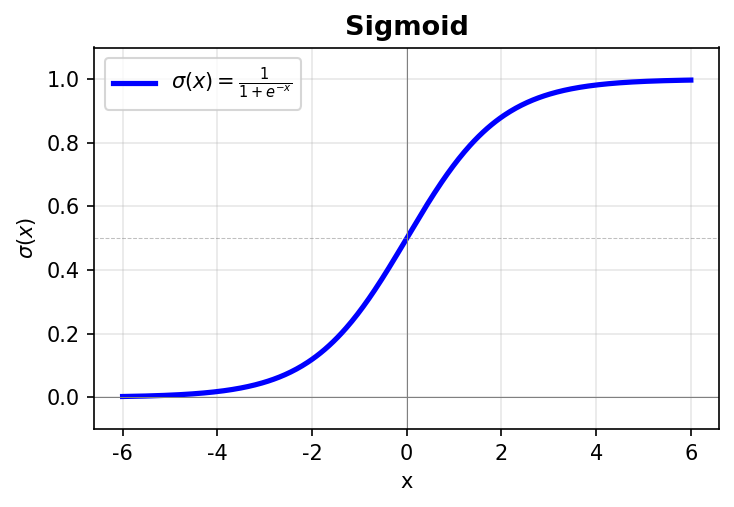
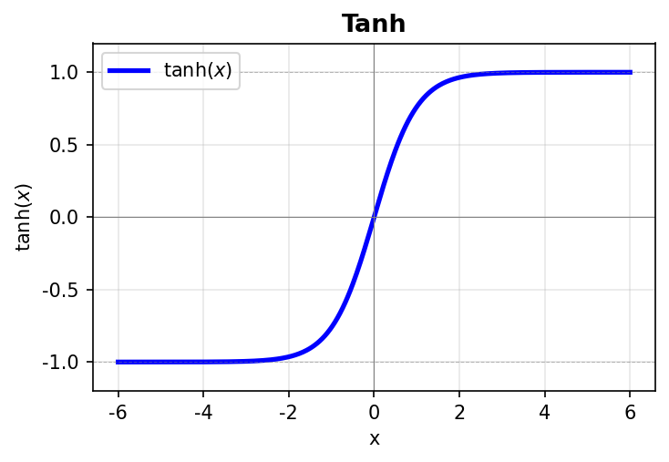
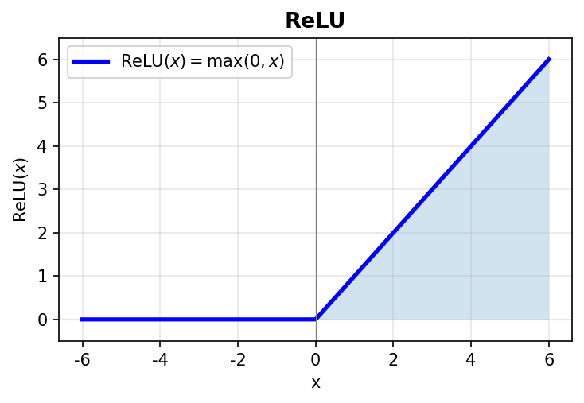
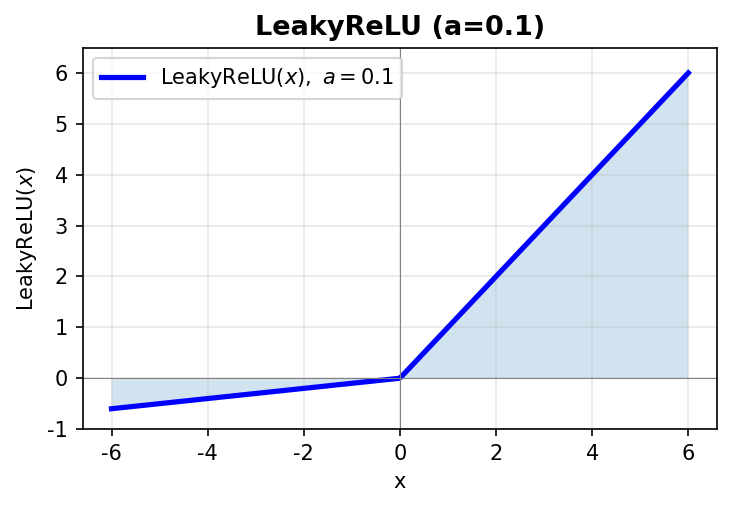
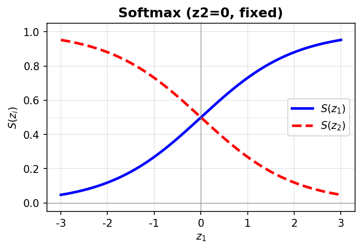

# 深度学习 & PyTorch 算法工程师面试题库

## 一、深度学习基础

### 1. 反向传播与梯度

<b>Q1：解释反向传播算法的工作原理</b>

反向传播（Backpropagation）是训练神经网络的核心算法，通过<b>链式法则</b>从输出层向输入层逐层计算梯度。前向传播计算每层激活值，反向传播计算损失对各参数的梯度。公式：∂L/∂W = δ·a^T，其中δ为误差项，逐层反向传递，最后使用梯度下降更新参数：θ = θ - η·∇L(θ)。

<b>Q2：什么是梯度消失和梯度爆炸？如何解决？</b>

深层网络中梯度逐层衰减导致底层参数几乎不更新称为<b>梯度消失</b>；梯度逐层放大导致参数震荡称为<b>梯度爆炸</b>。解决方案包括：合适的权重初始化（He/Xavier初始化）、使用ReLU/LeakyReLU等激活函数、Batch Normalization、残差连接（ResNet）、梯度裁剪（Gradient Clipping）、LSTM/GRU的门控机制。

<b>Q3：推导链式法则在反向传播中的应用</b>

对于复合函数y = f(g(x))，有dy/dx = (dy/du)·(du/dx)。神经网络是多层嵌套函数的复合：L = f(g(h(x)))，梯度逐层反向传播：∂L/∂W^(l) = ∂L/∂a^(l) · ∂a^(l)/∂z^(l) · ∂z^(l)/∂W^(l)，局部梯度乘以上游传来的梯度得到当前层参数的梯度。

### 2. 激活函数

<b>Q4：为什么需要非线性激活函数？</b>

若无激活函数，多层网络退化为单层线性变换。非线性激活函数使网络能拟合任意复杂函数。常用激活函数包括Sigmoid、Tanh、ReLU、LeakyReLU、Softmax。

<b>Q5：ReLU相比Sigmoid有哪些优势？</b>

ReLU计算快（max运算 vs exp运算）、在正区间无梯度饱和、可产生稀疏表示。缺点是存在Dead ReLU问题（负区间梯度为0）。LeakyReLU/PReLU/ELU是对ReLU的改进。

<b>Q6：Softmax的原理和求导</b>

Softmax将K个实数转为概率分布：S(z_i) = e^(z_i) / Σe^(z_j)。导数：对角线元素∂S_i/∂z_i = S_i(1 - S_i)，非对角线元素∂S_i/∂z_j = -S_i·S_j。数值稳定技巧：e^(z_i - max(z)) 防止溢出。通常配合交叉熵损失使用，避免梯度消失。

<br>

<figure>
  <b>Sigmoid</b><br>
  
  <figcaption>Sigmoid: 输出(0,1)，易梯度消失，多用于二分类输出层</figcaption>
</figure>

<figure>
  <b>Tanh</b><br>
  
  <figcaption>Tanh: 输出(-1,1)，零中心，常用于LSTM/GRU门控</figcaption>
</figure>

<figure>
  <b>ReLU</b><br>
  
  <figcaption>ReLU: f(x)=max(0,x)，计算快、无梯度消失，但负区间梯度为0（Dead ReLU）</figcaption>
</figure>

<figure>
  <b>LeakyReLU</b><br>
  
  <figcaption>LeakyReLU: 负区间有微弱梯度(a=0.1)，缓解Dead ReLU问题</figcaption>
</figure>

<figure>
  <b>Softmax</b><br>
  
  <figcaption>Softmax: 多分类输出层，将logits转为概率分布，和为1；z2固定=0时观察z1的softmax变化</figcaption>
</figure>

### 3. 归一化方法

<b>Q7：Batch Normalization的原理和作用</b>

对每个batch的每个通道进行标准化：μ_B = mean(x), σ_B² = var(x), x_norm = (x - μ_B) / √(σ_B² + ε), y = γ·x_norm + β（可学习的缩放和平移）。作用：缓解Internal Covariate Shift、加速收敛、允许更大学习率。训练/测试差异：训练用当前batch统计量，测试用训练时累积的running_mean/running_var。

<b>Q8：Layer Normalization与Batch Normalization的区别</b>

BatchNorm沿Batch方向(N)归一化，统计量来自Batch内所有样本，适用于CNN/CV任务。LayerNorm沿特征方向(C)归一化，对每个样本独立归一化，适用于RNN/NLP任务。LN对batch size不敏感，训练/测试行为一致。

<b>Q9：Instance Normalization和Group Normalization的适用场景</b>

Instance Norm (IN)：对每个样本的每个通道单独归一化，适用风格迁移、GAN。Group Norm (GN)：将通道分组，组内归一化，适用小batch的CV任务、目标检测，是LN和IN的泛化。

### 4. Dropout与正则化

<b>Q10：Dropout的原理和作用</b>

训练时随机将部分神经元输出置零（通常p=0.5），测试时所有神经元参与乘以(1-p)或使用inverted dropout。作用：减轻过拟合、类似集成学习、增加网络鲁棒性。

<b>Q11：Dropout和Batch Normalization能否一起使用？</b>

理论上可以，但实践中不推荐同时使用。BN已经提供正则化效果，Dropout的随机性可能干扰BN的统计量。常见做法是使用其中一个。

### 5. 优化器

<b>Q12：SGD、Momentum、Adam的区别和适用场景</b>

SGD简单但震荡大，适合大数据集和收敛后期。Momentum引入动量项v = γv + η∇L，加速收敛减少震荡。Adam结合Momentum和RMSProp，自适应学习率，收敛快效果好，是首选默认优化器。AdamW是Adam的改进，加入权重衰减正则化。面试常问：为什么Adam收敛快但泛化可能不如SGD？

<b>Q13：学习率衰减策略有哪些？</b>

固定衰减：Step LR（每N步减半）、指数衰减：Exponential LR、余弦退火：Cosine Annealing、Warmup：初期逐渐增大学习率稳定后衰减。PyTorch实现：`torch.optim.lr_scheduler`。

### 6. 损失函数

<b>Q13-2：常见损失函数总览</b>

| 损失函数 | 公式 | 适用场景 |
|---------|------|---------|
| BCE | -[y·log(p) + (1-y)·log(1-p)] | 二分类（CTR 预估） |
| Cross-Entropy | -Σ y_i·log(p_i) | 多分类 |
| Focal Loss | -α_t·(1-p_t)^γ·log(p_t) | 类别极度不平衡 |
| BPR Loss | -log σ(s_pos - s_neg) | 推荐 pairwise 排序 |
| Softmax Loss | CE(softmax(scores), label) | Listwise 排序 |
| InfoNCE | -log(exp(s_pos/τ) / Σexp(s_i/τ)) | 对比学习、双塔召回 |

<b>Q13-3：BCE（Binary Cross-Entropy）详解</b>

CTR 预估最基础的 loss。公式：`BCE = -[y·log(p) + (1-y)·log(1-p)]`

- y=1（点击）：loss = -log(p)，p 越大 loss 越小
- y=0（未点击）：loss = -log(1-p)，p 越小 loss 越小

**Logit**：模型最后一层 Linear 的原始输出值（实数，-∞ 到 +∞），还没经过 sigmoid。名字来源：sigmoid 的反函数就叫 logit 函数，logit(p) = log(p/(1-p))。

PyTorch 两个版本：

```python
F.binary_cross_entropy(sigmoid_output, label)         # 输入是 sigmoid 后的概率
F.binary_cross_entropy_with_logits(logit, label)       # 输入是 sigmoid 前的 logit（推荐）
```

后者内部合并 sigmoid + log 计算，避免 log(sigmoid(x)) 在极端值时的数值溢出。工业界 CTR 模型基本都用 `with_logits` 版本。

<b>Q13-4：Focal Loss 详解</b>

**来源**：RetinaNet（Lin et al., ICCV 2017），解决类别极度不平衡时标准 CE 被大量**简单样本**主导梯度的问题。

**公式**：在标准 BCE 上加调制因子 (1 - p_t)^γ：

```
FL(p_t) = -α_t · (1 - p_t)^γ · log(p_t)

其中 p_t = p（当 y=1）或 1-p（当 y=0）
含义：模型对正确答案的置信度
```

- **γ（focusing parameter，通常取 2）**：p_t 大（模型已很确定）→ (1-p_t)^γ 极小 → loss 被大幅压低；p_t 小（模型预测错误）→ (1-p_t)^γ ≈ 1 → loss 基本不变。
- **α_t**：类别权重因子，正例 α、负例 1-α，处理正负数量不平衡。

**γ=2 时的数值感受**：

| 样本 | p_t（对正确答案的置信度） | CE loss | Focal loss | 衰减 |
|------|--------------------------|---------|------------|------|
| 简单样本（模型很确定） | 0.9 | 0.105 | 0.001 | 100x 压低 |
| 中等难度 | 0.5 | 0.693 | 0.173 | 4x |
| 困难样本（模型不确定） | 0.1 | 2.303 | 1.867 | 仅 1.2x |

**核心：Focal Loss 不区分正负样本，区分的是简单 vs 困难。** 正样本如果模型已经很有把握（p_t 高），同样会被压低 loss。检测领域常说"压低负样本"是因为简单样本中绝大多数恰好是负样本（背景区域），但机制本身和正负无关，只和难易有关。

**CTR/CTCVR 场景需要 Focal Loss 吗？**

CTR/CTCVR 确实存在正负不平衡（CTR 正样本率 1%-5%，CTCVR 低至 0.05%-0.5%），但工业界**几乎不用 Focal Loss**，原因：

1. **破坏概率校准**：CTR 模型的预测概率直接参与出价计算（eCPM = pCTR × bid），Focal Loss 的 (1-p_t)^γ 改变了 loss 曲率，模型输出的概率值不准——排序没问题但绝对概率偏了，出价失真。
2. **工业标准做法是负样本降采样 + 校准修正**：训练时随机丢弃部分负样本（如保留 10%），推理时用校准公式还原：`p_cal = p / (p + (1-p) / sampling_rate)`。简单、有效、不破坏校准。
3. **其他替代**：加权 BCE（调正负权重，不改 loss 曲率）、Hard Negative Mining（采样层面选更难的负样本）。

**Focal Loss 可用的场景**：纯排序（不需校准概率）、多分类（行为类型预测）、不方便改采样策略时。

```python
def focal_loss(pred, target, gamma=2.0, alpha=0.25):
    """pred: logits (未经 sigmoid)"""
    bce = F.binary_cross_entropy_with_logits(pred, target, reduction='none')
    p_t = torch.exp(-bce)  # 对正确类别的置信度
    focal_weight = alpha * (1 - p_t) ** gamma
    return (focal_weight * bce).mean()
```

<b>Q13-5：InfoNCE Loss（对比学习 / 双塔召回常用）</b>

```
L = -log( exp(sim(q, k+) / τ) / Σ exp(sim(q, k_i) / τ) )
```

本质是把正例得分在所有候选（正例+负例）中做 softmax，最大化正例的 softmax 概率。温度 τ 越小分布越尖锐，对难负例更敏感。双塔召回的 in-batch softmax loss 就是 InfoNCE 的一种实现。

---

## 二、PyTorch核心机制

### 2.1 nn.Module机制

<b>Q14：如何定义一个神经网络模型？</b>

必须继承nn.Module，实现`__init__`（定义层）和`forward`（定义计算图）。PyTorch自动调用forward（通过`__call__`触发）。

```python
class MyNet(nn.Module):
    def __init__(self):
        super().__init__()
        self.conv1 = nn.Conv2d(3, 32, 3, padding=1)
        self.bn1 = nn.BatchNorm2d(32)
        self.fc = nn.Linear(32*32*32, 10)
    
    def forward(self, x):
        x = F.relu(self.bn1(self.conv1(x)))
        x = x.view(x.size(0), -1)
        return self.fc(x)
```

<b>Q15：parameters()和named_parameters()的区别？</b>

`parameters()`返回所有可学习参数的迭代器，`named_parameters()`返回(name, param)元组的迭代器。常用于传递给优化器：`optimizer = SGD(model.parameters(), lr=0.01)`。

<b>Q16：children()、modules()、named_children()的区别</b>

`children()`返回直接子模块（不递归），`modules()`递归返回所有模块。`named_*`版本会同时返回模块名称。用于模型结构分析、参数统计、特征提取等。

### 2.2 autograd自动微分

<b>Q17：PyTorch autograd的工作原理</b>

动态计算图：每次前向传播时自动构建。DAG结构：节点是Tensor，边是操作（Function）。叶子节点是输入张量（requires_grad=True），根节点是输出张量。反向传播时从根到叶，利用链式法则计算梯度。每次迭代从头重建，支持任意Python控制流。

<b>Q18：PyTorch中如何进行梯度计算？</b>

```python
x = torch.tensor([1., 2.], requires_grad=True)
y = x**2 + 3*x
loss = y.sum()
loss.backward()  # 反向传播
print(x.grad)  # [5., 7.] = 2x + 3
```

梯度会累积，需在每次迭代前清零：`optimizer.zero_grad()`。

<b>Q19：torch.no_grad()和model.eval()的区别？</b>

`no_grad()`禁用梯度计算和图构建，用于推理、参数更新。`model.eval()`切换BN/Dropout行为，用于模型评估。两者常配合使用：`with torch.no_grad(): output = model(x)`。

<b>Q20：inplace操作在autograd中的注意事项</b>

不推荐使用inplace操作如`x.add_(1)`，可能覆盖计算图所需的值。PyTorch有版本计数器检测inplace修改，若报错可禁用版本检查（不推荐）或使用非原地版本。

### 2.3 GPU与显存管理

<b>Q21：如何在PyTorch中正确使用GPU？</b>

```python
if torch.cuda.is_available():
    device = torch.device('cuda')
model = model.to(device)
x = x.to(device)
# 多GPU并行
if torch.cuda.device_count() > 1:
    model = nn.DataParallel(model)
```

<b>Q22：PyTorch显存管理机制和优化方法</b>

显存占用来源：模型参数、梯度、优化器状态、中间激活值。优化方法：梯度清零`optimizer.zero_grad(set_to_none=True)`、手动释放`del tensor; torch.cuda.empty_cache()`、混合精度训练`torch.cuda.amp`、梯度累积模拟大batch、合理设置`num_workers`。

<b>Q23：nn.DataParallel和DistributedDataParallel的区别</b>

DataParallel (DP)：单进程多线程，通过PyTorch主进程通信，效率较低有负载不均衡，支持单机多卡。DistributedDataParallel (DDP)：多进程，异步通信，效率高，推荐使用，支持多机多卡。

### 2.4 DataLoader与数据处理

<b>Q24：如何自定义PyTorch Dataset？</b>

```python
class MyDataset(Dataset):
    def __init__(self, data, labels):
        self.data = data
        self.labels = labels
    
    def __len__(self):
        return len(self.data)
    
    def __getitem__(self, idx):
        return self.data[idx], self.labels[idx]
```

必须实现`__len__`和`__getitem__`。

<b>Q25：DataLoader的关键参数和作用</b>

```python
DataLoader(
    dataset,
    batch_size=32,
    shuffle=True,          # 打乱数据
    num_workers=4,         # 多进程加载
    pin_memory=True,       # 加速GPU传输
    drop_last=True,       # 丢弃最后不完整batch
    collate_fn=custom_fn  # 自定义批处理
)
```

### 2.5 模型训练技巧

<b>Q26：模型微调（Fine-tuning）的方法</b>

```python
# 方式1：冻结大部分参数
for param in model.parameters():
    param.requires_grad = False
model.fc = nn.Linear(512, 10)  # 只训练新层

# 方式2：不同层不同学习率
optimizer = torch.optim.SGD([
    {'params': model.conv1.parameters(), 'lr': 1e-5},
    {'params': model.fc.parameters(), 'lr': 1e-3}
], lr=1e-5)
```

<b>Q27：梯度裁剪的实现和作用</b>

```python
torch.nn.utils.clip_grad_norm_(model.parameters(), max_norm=1.0)  # 裁剪梯度范数
torch.nn.utils.clip_grad_value_(model.parameters(), clip_value=1.0)  # 裁剪梯度值
```

防止梯度爆炸，尤其在RNN/LSTM中。

<b>Q28：PyTorch模型的保存和加载</b>

```python
torch.save(model.state_dict(), 'model_weights.pth')  # 推荐，只保存参数
model = MyModel()
model.load_state_dict(torch.load('model_weights.pth'))
model.eval()  # 推理模式
```

### 2.6 高级特性

<b>Q29：如何创建自定义autograd Function？</b>

```python
class Exp(Function):
    @staticmethod
    def forward(ctx, x):
        ctx.save_for_backward(x)
        return x.exp()
    
    @staticmethod
    def backward(ctx, grad_output):
        x, = ctx.saved_tensors
        return grad_output * x.exp()
```

必须实现`forward`和`backward`静态方法，`ctx`用于保存前向传播需要的中间变量。

---

## 三、推荐系统/搜广推算法

### 3.1 推荐系统架构

<b>Q30：推荐系统的整体架构流程</b>

用户请求 → 召回(Recall) → 粗排(Pre-rank) → 精排(Rank) → 重排(Rerank) → 推荐结果。召回从百万/亿级候选中快速筛选千/万级别，粗排从万级到百级，精排用复杂模型最终排序，重排做多样性、频控、商业规则干预。

<b>Q31：为什么需要多阶段召回？</b>

候选集规模大（亿级），无法直接精排。多路召回分工明确：协同过滤、向量召回、热门召回等，各路互补保证覆盖率。线上延迟要求高，需快速响应。

### 3.2 召回模型

<b>Q32：DSSM双塔模型的原理和优缺点</b>

用户塔处理用户行为序列输出用户向量，物品塔处理物品特征输出物品向量，相似度用内积/Dot(u, v)计算。优点：用户向量可离线更新，线上快速检索。缺点：无法在召回阶段做用户-物品特征交叉。

<b>Q33：协同过滤（CF）的原理</b>

User-CF找相似用户推荐其喜欢的物品，Item-CF找相似物品推荐。核心是计算相似度（余弦/皮尔逊）。

<b>Q34：向量召回中如何做近似最近邻搜索？</b>

暴力搜索全量比对精度高但慢。LSH局部敏感哈希将相似向量映射到同一桶。HNSW分层可导航小世界图，高召回高速。Faiss是Facebook开源向量检索库支持多种索引。

### 3.3 排序模型

<b>Q35：Wide&Deep的原理</b>

Wide部分线性模型记忆用户历史行为特征组合，Deep部分DNN泛化学习新特征交叉。联合训练同时优化Wide和Deep。作用：平衡"记忆"（短期高效）和"泛化"（长期覆盖）。

<b>Q36：DeepFM相比Wide&Deep的改进</b>

Wide&Deep需要人工设计Wide部分的特征交叉，DeepFM用FM层自动学习二阶特征交叉。DeepFM = FM + Deep，同时学习低阶（FM）和高阶（DNN）特征交叉。

<b>Q37：DIN（Deep Interest Network）的原理</b>

传统方法对用户行为序列做简单Pooling。DIN引入注意力机制，动态计算每个历史物品对当前候选的权重，Activation Unit计算候选广告与历史行为的相似度，更好地捕捉用户多样化兴趣。

### 3.4 多目标学习

<b>Q38：ESMM的原理</b>

CVR建模的挑战：样本稀疏、延迟反馈。ESMM同时建模CTR和CTCVR，利用CTCVR = CTR × CVR的关系，在全样本空间（曝光）上训练，避免样本选择偏差。

<b>Q39：MMOE和PLE的区别</b>

MMOE：多个Expert网络，任务专属Gate门控。PLE在MMOE基础上增加任务专属Expert，分离共享和独有参数，更好地缓解任务间负迁移问题。

<b>Q39-补充：ESMM / MMoE / PLE 的 loss 都没有优化跷跷板</b>

三者的创新维度不同，但 loss 都是**直接相加、权重手调**：

```python
# ESMM：创新在 loss 的构造方式（乘积关系），但两项仍然等权相加
loss = BCE(pCTR, y_click) + BCE(pCTR * pCVR, y_convert)

# MMoE / PLE：创新在架构（Expert + Gate），loss 仍然手调权重相加
loss = w1 * loss_task1 + w2 * loss_task2
```

| 模型 | 创新维度 | loss 优化 | 解决了什么 | 没解决什么 |
|------|---------|----------|-----------|-----------|
| ESMM | loss 构造 | 无 | 样本选择偏差（CVR 在全量曝光上训练） | 跷跷板 |
| MMoE | 架构 | 无 | 任务间信息共享（各任务选不同 Expert 组合） | 跷跷板 |
| PLE | 架构 | 无 | 任务专属参数隔离（减少负迁移） | 跷跷板（减轻但未消除） |

**跷跷板的解法（UW / PCGrad / GradNorm）是独立技术，叠加到上述任意模型上使用。** 三个维度正交，可任意组合：

```
选架构（怎么共享参数）：Shared-Bottom → MMoE → PLE
选 loss 构造（解决什么偏差）：直接 BCE → ESMM（解决样本选择偏差）
选 loss 优化（解决跷跷板）：手调权重 → UW / GradNorm / PCGrad
```

### 3.4.1 多任务跷跷板问题（梯度冲突）

<b>Q39-2：什么是跷跷板问题？</b>

多任务模型（如 ESMM/MMoE/PLE）中，多个 loss 加起来训练：`total_loss = loss_A + loss_B`。backward 时两个任务分别对共享参数产生梯度 g_A 和 g_B。当 g_A 和 g_B 方向相反（余弦相似度 < 0），参数被两边拉扯，优化一个就损害另一个。

ESMM 解决了 CVR 的**样本选择偏差**（通过 pCTCVR = pCTR × pCVR 在全量曝光上训练），但**没有解决跷跷板**——共享 embedding 上 CTR 和 CVR 的梯度仍然可能方向相反。

**典型冲突场景**：

| 场景 | 冲突 |
|------|------|
| CTR + CVR | 标题党商品：CTR 高但 CVR 低，CTR 想推、CVR 想压 |
| CTR + CPM 成本 | 高 CPM 广告被点了：CTR 想让 pCTR 升高、成本项想让 pCTR 降低 |

两者本质相同：两个 loss 对同一组共享参数方向相反。

<b>Q39-3：跷跷板的三层解法</b>

冲突分两个维度：**梯度量级不平衡**（一个大一个小）和**梯度方向冲突**（方向相反）。不同解法针对不同维度，可以叠加。

---

**第一层：架构隔离（PLE）—— 减少冲突发生**

```
普通共享：
  共享 Embedding → CTR Tower  → g_A ↘
                 → Cost Tower → g_B ↗  在共享参数上打架

PLE：
  共享 Expert  → Gate 选择性使用（少量冲突）
  CTR 专属 Expert → 只给 CTR Tower（无冲突）
  CVR 专属 Expert → 只给 CVR Tower（无冲突）
```

大部分梯度走各自专属参数，只有共享 Expert 上还有残余冲突。**从源头减少冲突概率**。

---

**第二层：自动调权重（Uncertainty Weighting）—— 解决量级不平衡**

问题：`total_loss = w1*L_A + w2*L_B`，w1、w2 手调难。想让权重可学习，但直接学 w 会趋向 0（loss 对 w 的梯度是正的，梯度下降让 w 一直减小）。

解法：加惩罚项 log(σ) 防止权重归零。

```
total_loss = (1/σ₁²)·L_A + log(σ₁) + (1/σ₂²)·L_B + log(σ₂)
```

- 1/σ² 是权重：σ 大 → 权重小
- log(σ) 是惩罚：σ 大 → 惩罚大，阻止 σ 无限增大

**两项互相制衡**，σ 不会归零也不会无穷大，自动稳定在平衡点 σ² ≈ L_i：

```
loss_ctr = 0.3（学得好，loss 小）→ σ₁² ≈ 0.3 → 权重 ≈ 3.3（大）
loss_cost = 2.0（噪声大，loss 大）→ σ₂² ≈ 2.0 → 权重 ≈ 0.5（小）
```

效果：**噪声大的任务权重自动降低，信号好的任务权重自动升高**。

实现：学 `s = log(σ²)` 避免正约束，s 和模型参数一起放进 optimizer，一起 backward 更新。

```python
s1 = nn.Parameter(torch.zeros(1))  # log(σ₁²)
s2 = nn.Parameter(torch.zeros(1))  # log(σ₂²)
optimizer = Adam(list(model.parameters()) + [s1, s2], lr=1e-3)

# 前向
total_loss = torch.exp(-s1) * loss_ctr + s1 / 2 \
           + torch.exp(-s2) * loss_cost + s2 / 2
total_loss.backward()  # s1, s2 和模型参数一起更新
```

**局限**：只调权重大小，不改方向。两个梯度方向相反时，权重调再大加起来还是抵消。

---

**第三层：梯度投影（PCGrad）—— 解决方向冲突**

直接在梯度空间操作：当两个任务梯度方向冲突时，把冲突分量砍掉。

```
g_A = [+0.5, +0.3]    （CTR 想让参数往右上走）
g_B = [-0.8, -0.2]    （成本想让参数往左下走）

检测：g_A · g_B = -0.46 < 0 → 冲突

投影：把 g_A 中"和 g_B 对着干"的分量去掉
  g_A' = g_A - (g_A·g_B / ||g_B||²) · g_B

投影前：g_A + g_B = [-0.3, +0.1]  ← 互相抵消，几乎不动
投影后：g_A' + g_B' = 往两边都不反对的方向走
```

```python
def pcgrad_step(loss_a, loss_b, shared_params):
    g_a = torch.autograd.grad(loss_a, shared_params, retain_graph=True)
    g_b = torch.autograd.grad(loss_b, shared_params)
    g_a, g_b = flatten(g_a), flatten(g_b)
    
    cos = torch.dot(g_a, g_b)
    if cos < 0:  # 冲突
        g_a = g_a - (torch.dot(g_a, g_b) / torch.dot(g_b, g_b)) * g_b
    
    # 用修正后的梯度更新参数
    final_grad = g_a + g_b
    write_grad_back(shared_params, final_grad)
```

**缺点**：每步需要两次独立 backward，计算成本翻倍。

---

**其他方法（了解即可）**：

| 方法 | 思路 | 计算成本 |
|------|------|---------|
| GradNorm（2018） | 动态调 loss 权重使各任务梯度范数相等，落后的任务加权 | 低 |
| CAGrad（2021） | 找最大化所有任务最小提升的梯度方向（比 PCGrad 更优） | 高 |
| Nash-MTL（2022） | 纳什博弈求解（理论最优） | 很高 |

---

**工业界最佳实践：三层叠加**

```
PLE（架构层面）     → 大部分参数不冲突
+ Uncertainty Weighting（loss 层面）→ 残余共享参数上自动调权重
+ PCGrad（梯度层面，可选）         → 处理方向冲突
```

**面试要点**：
- ESMM 解决的是样本选择偏差，不是跷跷板
- 跷跷板的根因是共享参数上梯度方向相反
- 调权重（UW/GradNorm）只解决量级问题，不解决方向问题
- PCGrad 解决方向问题但计算翻倍
- PLE 从架构层面减少共享参数是最根本的方案

### 3.5 冷启动问题

<b>Q40：如何解决推荐系统的冷启动问题？</b>

用户冷启动：热门推荐、新用户引导问卷、社交网络好友推荐、基于人口统计的默认推荐。物品冷启动：内容特征相似物品的热度迁移、Explore & Exploit策略、人工干预曝光。技术方案：元学习（MAML）、跨域推荐、强化学习探索。

### 3.6 评估指标

<b>Q41：推荐系统的常用评估指标</b>

AUC：排序能力，随机正负样本对正样本排在前面的概率。CTR：点击率，点击/曝光。CVR：转化率，转化/点击。NDCG：排序质量，考虑位置衰减。覆盖率：推荐物品占候选集比例。多样性：推荐结果之间的差异性。

<b>Q41-补充：HR@K 和 NDCG@K 的详细解释</b>

这两个指标是推荐系统 Top-K 评估中最常用的离线指标，考察模型在只返回前 K 个结果时的表现。

**HR@K（Hit Rate at K，命中率）**

定义：在所有测试用户中，推荐列表的前 K 个结果中至少包含 1 个用户真实感兴趣物品（Ground Truth）的用户比例。

公式：HR@K = (命中的用户数) / (总测试用户数)

对单个用户：若 Top-K 推荐列表中存在目标物品则该用户命中（hit=1），否则 hit=0。HR@K 是所有用户 hit 值的平均。

HR 只关心「有没有命中」，不关心目标物品排在第几位。

**NDCG@K（Normalized Discounted Cumulative Gain，归一化折损累积收益）**

定义：衡量 Top-K 推荐列表的排序质量，不仅关注是否命中，还关注命中的位置——排越靠前的命中得分越高。

计算步骤：

1. DCG@K（折损累积收益）：DCG@K = Σ rel_i / log2(i+1)，i 为物品在列表中的位置（从1开始），rel_i 为该位置物品的相关性（0或1）。若第 i 位命中则 rel_i=1，否则为 0。
2. IDCG@K（理想 DCG）：将命中物品排在最前面时的 DCG 值，是 DCG 的上界。对于单个 Ground Truth 物品，IDCG@K = 1/log2(2) = 1。
3. NDCG@K = DCG@K / IDCG@K，结果归一化到 [0, 1]。

直觉理解：目标物品排第 1 位得分最高，排第 K 位得分最低，没命中得 0 分。相比 HR 更能区分「排第1命中」和「排第10命中」的差别。

**HR@3 / HR@5 / HR@10 对比**

K 值越小，评估越严格。HR@3 要求模型把正确物品排进前3，HR@10 则宽松很多。实际中 HR@10 通常比 HR@3 高得多。

| 指标 | 说明 | 特点 |
|------|------|------|
| HR@3 | 前3中命中 | 最严格，反映头部精准性 |
| HR@5 | 前5中命中 | 中等严格 |
| HR@10 | 前10中命中 | 较宽松，反映召回能力 |
| NDCG@3 | 前3考虑排序质量 | 奖励排第1，惩罚排第3 |
| NDCG@5 | 前5考虑排序质量 | 中等 |
| NDCG@10 | 前10考虑排序质量 | K越大，位置折损越明显 |

**典型面试题：HR@K vs NDCG@K 的区别**

HR@K 只看命中与否，NDCG@K 同时考虑命中位置。例如同一个模型对 100 个用户预测，若目标物品都排在第 K 位，HR@K 与排第 1 位时相同，但 NDCG@K 会更低。因此 NDCG 是比 HR 更精细的排序质量指标，论文中两者通常同时汇报。

**代码示例（NumPy 实现）**

```python
import numpy as np

def hr_at_k(top_k_items, ground_truth):
    """top_k_items: list of K recommended items; ground_truth: target item"""
    return 1.0 if ground_truth in top_k_items else 0.0

def ndcg_at_k(top_k_items, ground_truth):
    """NDCG@K for single ground truth item"""
    if ground_truth not in top_k_items:
        return 0.0
    rank = top_k_items.index(ground_truth) + 1  # 1-indexed
    return 1.0 / np.log2(rank + 1)  # IDCG = 1/log2(2) = 1

# 示例：目标物品排第2位
preds = ['A', 'target', 'C', 'D', 'E']
gt = 'target'
print(f"HR@5={hr_at_k(preds, gt):.2f}")     # 1.00（命中）
print(f"NDCG@5={ndcg_at_k(preds, gt):.4f}") # 0.6309（排第2，log2(3)≈1.585）
```

---

## 四、综合应用题

<b>Q42：PyTorch训练流程代码实现</b>

```python
train_loader = DataLoader(train_dataset, batch_size=64, shuffle=True)
model = MyNet().to(device)
criterion = nn.CrossEntropyLoss()
optimizer = torch.optim.Adam(model.parameters(), lr=1e-3)

model.train()
for epoch in range(num_epochs):
    for batch_idx, (data, target) in enumerate(train_loader):
        data, target = data.to(device), target.to(device)
        optimizer.zero_grad()
        output = model(data)
        loss = criterion(output, target)
        loss.backward()
        optimizer.step()
```

<b>Q43：手写一个两层全连接网络反向传播</b>

单层前向: z = Wx + b, a = ReLU(z)。单层梯度: dL/dW = dL/da * da/dz * dz/dW = δ · x^T。对于两层网络：L = Loss(y_pred, y_true)，δ_L = ∂L/∂a_L（输出层误差），δ_2 = (W_2^T @ δ_L) * ReLU'(z_2)（第二层误差），∂L/∂W_2 = δ_L @ a_1^T，∂L/∂W_1 = δ_2 @ x^T。

<b>Q44：实现一个自定义BatchNorm层</b>

```python
class MyBatchNorm:
    def __init__(self, num_features, eps=1e-5, momentum=0.1):
        self.gamma = nn.Parameter(torch.ones(num_features))
        self.beta = nn.Parameter(torch.zeros(num_features))
        self.eps = eps
        self.momentum = momentum
        self.running_mean = torch.zeros(num_features)
        self.running_var = torch.ones(num_features)
    
    def forward(self, x, training=True):
        if training:
            mean = x.mean(dim=0)
            var = x.var(dim=0)
            self.running_mean = (1-self.momentum)*self.running_mean + self.momentum*mean
            self.running_var = (1-self.momentum)*self.running_var + self.momentum*var
        else:
            mean, var = self.running_mean, self.running_var
        x_norm = (x - mean) / torch.sqrt(var + self.eps)
        return self.gamma * x_norm + self.beta
```

---

## 五、高频手撕代码题

1. 实现Softmax函数（含数值稳定）
2. 实现ReLU及其导数
3. 实现两层神经网络的前向和反向传播
4. 实现一个简单的Attention机制
5. 用PyTorch实现一个CNN分类器
6. 实现梯度裁剪
7. 实现模型参数的freeze/unfreeze
8. 手写一个数据增强函数

<b>Q45：RLHF的原理和流程</b>

强化学习用于 LLM 对齐（RLHF），完整流程分两步：第一步训练 Reward Model，第二步用 PPO 微调 LLM。Reward Model 训练数据来自人类两两比较同一问题的多个回答，输出一个标量分数。打分模型训好之后固定不动，PPO 负责优化 LLM 的参数，让它生成更高 reward 的回答，同时用 KL 散度约束不要偏离原始模型太远。

<b>Q46：PPO（Proximal Policy Optimization）详解</b>

PPO 全称 Proximal Policy Optimization（近端策略优化），是 RLHF 中最主流的强化学习优化器，2017 年由 Schulman 等人提出。核心目标是限制每次参数更新的幅度，防止模型跑偏。PPO 的目标函数为 L^CLIP(θ) = E[ min(r_t(θ) * A_t, clip(r_t(θ), 1-ε, 1+ε) * A_t) ]，其中 r_t(θ) = π_θ / π_old 是新旧策略的概率比，A_t 是优势函数（该动作比平均好多少），clip 操作将 r_t 限制在 [1-ε, 1+ε] 范围内防止更新过大。在 LLM 的 RLHF 场景下，PPO 需要三个模型同时在显存里：Policy（被优化的 LLM）、Old Policy（生成训练样本的旧版本）和 Critic（Value Network，估计未来累积奖励）。这导致 billion 参数规模下显存压力极大，需要十几张 H100 才能容纳。

<b>Q47：DPO（Direct Preference Optimization）详解</b>

DPO 全称 Direct Preference Optimization（直接偏好优化），2023 年由 Rafailov 等人提出，核心创新是彻底去掉 Value Network，只用一个 LLM 直接优化。DPO 的偏好数据是三元组（问题 x, 偏好回答 y+, 不偏好回答 y-），损失函数为 L_DPO = - E[ log σ( β * (log π(y+|x) - log π(y-|x)) ) ]，直观理解是让 preferred 回答的概率升高、dispreferred 回答的概率降低。DPO 的精妙之处在于通过数学变形把 reward function 在最终公式里消掉了，不需要单独训练 reward model，省掉了一个巨大模型的显存开销。但 DPO 是 off-policy 的——用旧策略生成的数据训练新策略，容易因分布偏移而过早收敛。

<b>Q48：S-DPO 的原理和 off-policy 问题</b>

S-DPO 把 DPO 的思想迁移到推荐系统，推荐系统没有人工标注的偏好对，S-DPO 的做法是把正样本（用户真实交互的物品）当作 y+，随机采样的负样本当作 y-，套用 DPO 框架。这实际上是 BPR 思想的延续——正样本的排序应该高于负样本。但 S-DPO 继承了 DPO 的 off-policy 问题：用历史生成的旧数据训练当前模型，训练过程中模型在变但训练数据是静态的，容易导致过早收敛。

<b>Q49：GRPO（Group Relative Policy Optimization）详解</b>

GRPO 全称 Group Relative Policy Optimization，2024 年由 DeepSeek 团队提出，核心改进两点：一是用规则信号替代 Learned Reward Model，在数学/代码场景里答案对不对可以客观判定，不需要偏好标注；二是用 batch 内相对比较替代 Critic，同一批生成的样本内部做 reward 归一化，不需要单独训练一个 Value Network 来估计 V(s)。具体做法：对一个 prompt 用当前策略生成 G 个回答，对每个回答用规则打分（0/1），在 group 内归一化得到相对优势 r_i = (R(o_i) - mean) / std，不需要绝对分数，只需要相对排名。GRPO 因此省掉了 reward model 和 critic 两个大模型，显存需求大幅降低，是 PPO 的轻量化替代方案，适用于有客观评判标准的任务（数学、代码、推荐点击）。

<b>Q50：Beam Search 详解及其与 LLM 推理的关系</b>

Beam Search 是一种启发式搜索算法，用于序列生成中寻找近似的全局最优解。核心思想是：不是每步选概率最高的 token（贪心），而是并行保留 K 条最优候选路径，最后从 K 条完整序列中选最优。Beam Width = K 控制搜索宽度，K=1 等同于贪心搜索，K 越大越接近最优但计算量越大。LLM 生成每个 token 时，模型对整个词表输出概率分布，Beam Search 在每一步都扩展 K 条路径、排序取 Top-K，重复直到 EOS。Beam Search 主要用在机器翻译、代码生成等对质量要求高的场景，日常聊天对话通常用贪心或采样（按概率随机抽取），因为 Beam Search 延迟高（K 倍计算量）且倾向于生成保守回答、缺乏多样性。

<b>Q51：LLM 推理的三种解码策略对比</b>

| 解码策略 | 是否生成多次 | 速度 | 质量 | 适用场景 |
|---------|------------|------|------|---------|
| 贪心（Greedy）| 只生成一次 | 最快 | 一般 | 快速推理 |
| 采样（Sampling）| 只生成一次 | 快 | 不稳定 | 日常对话、创意写作 |
| Beam Search | 生成 K 条路径 | 慢 K 倍 | 最好 | 机器翻译、代码生成 |

采样是对每个 token 按概率分布随机抽取，同一个问题问两遍会得到不同回答，适合追求多样性的场景。贪心是每次选概率最高的 token，速度最快但缺乏变化。Beam Search 追求最优序列，但计算量是 K 倍，延迟敏感的场景一般不用。

---

## 六、推荐系统因果推断与偏差校正

> **核心问题**：推荐系统的训练数据本身就是"有偏"的——用户只能看到系统推荐的内容，点击行为受位置/流行度/展示方式等混杂因素影响。因果推断的目标是：**从有偏的观察数据中，学到用户的真实偏好**。

### 6.1 推荐系统中的偏差类型（全景图）

| 偏差类型 | 描述 | 危害 | 典型场景 |
|---------|------|------|---------|
| **位置偏差（Position Bias）** | 用户倾向点击靠前的结果，不管质量 | CTR 虚高 → 自我强化的马太效应 | 搜索结果、Feed 流 |
| **选择偏差（Selection Bias）** | 未曝光 item 没有标签（MNAR） | 模型只学"被推荐过的" → 偏离真实兴趣 | 所有推荐场景 |
| **流行度偏差（Popularity Bias）** | 热门 item 过度曝光，数据量大 | 长尾 item 无法被发现，多样性差 | 电商/音乐/视频 |
| **确认偏差（Confirmation Bias）** | 用户倾向点击符合既有认知的内容 | 信息茧房，推荐越来越窄 | 新闻/资讯推荐 |
| **曝光偏差（Exposure Bias）** | 用户只能对曝光的 item 反馈 | 与 Selection Bias 类似，但强调曝光机制 | 列表推荐 |
| **反馈循环偏差（Feedback Loop）** | 推荐 → 点击 → 强化推荐 → 更多点击 | 系统逐渐收敛到少量 item，"赢家通吃" | 所有在线系统 |
| **时间偏差（Temporal Bias）** | 节假日/热点事件导致的短期兴趣偏移 | 模型将短期热点当作长期偏好 | 电商大促/新闻热点 |

**因果图（DAG）理解偏差**：

```
真实兴趣 U ──→ 点击 Y
                ↑
位置 P ─────────┘    ← 混杂因素（Confounder）
                ↑
流行度 Pop ─────┘    ← 另一个混杂因素
```

观察到的 P(Y|item) 混杂了真实偏好和位置/流行度效应，需要做 **do-calculus** 来去混杂：
- 观察量：P(Y | item, position) — 带混杂
- 因果量：P(Y | do(item)) — 假如"强制"展示这个 item，用户会不会点？

---

### 6.2 问题-场景-算法 对照表

| 问题 | 具体场景 | 算法 | 核心思想 |
|------|---------|------|---------|
| 位置偏差 | 搜索/Feed 排序 | **IPW** | 按 1/P(click\|pos) 加权 |
| 位置偏差 | YouTube/美团 | **Position Tower** | 训练时加位置塔，推理时去掉 |
| 位置偏差 | 华为 | **PAL** | pCTR = pCTR_true × P(examine\|pos) |
| 选择偏差 | 评分预测（Netflix） | **IPW + Doubly Robust** | IPS 加权 + 误差模型双重保险 |
| 选择偏差 | 隐式反馈 | **CausE** | 用少量随机曝光数据做正则 |
| 流行度偏差 | 协同过滤 | **PDA / Causal Embedding** | 去混杂流行度信号 |
| 流行度偏差 | 知识图谱推荐 | **MACR** | Model-Agnostic 反事实推理 |
| 反馈循环 | 在线推荐 | **随机探索 + Off-policy** | ε-greedy / Thompson Sampling |
| 用户干预效果 | Push/优惠券 | **Uplift Modeling** | 找 Persuadables |
| 多种偏差共存 | 工业系统 | **AutoDebias** | 元学习自动去偏 |

---

### 6.3 位置偏差校正（详解）

#### 方法一：IPW（Inverse Propensity Weighting）

**直觉**：位置 1 的点击"不值钱"（本来就容易被点），位置 10 的点击很珍贵（说明真的感兴趣），所以反向加权。

```python
def ipw_loss(predictions, labels, positions, propensity_model):
    """
    predictions: (N,)  模型预测的 pCTR
    labels:      (N,)  实际点击标签
    positions:   (N,)  item 在结果列表中的位置
    """
    # 倾向分 = P(click | position)，位置越靠前越高
    propensity = propensity_model(positions)  # e.g. pos1→0.9, pos10→0.1
    
    # 逆倾向加权：位置靠后的正例权重更大
    weights = 1.0 / (propensity + 1e-8)
    # clip weights 防止极端值
    weights = torch.clamp(weights, max=100.0)
    
    loss = F.binary_cross_entropy(predictions, labels.float(), weight=weights)
    return loss
```

**Propensity Score 怎么估？**
- **方法 A：随机实验**（RCT）：线上小流量随机打乱排序，统计每个位置的 CTR → 就是 P(click|pos)
- **方法 B：EM 算法**：假设 click = examine × relevance，用 EM 迭代估计 P(examine|pos)
- **方法 C：Swap Trick**：同一个 query 下，同一个 item 出现在不同位置的 CTR 比值 → 位置的倾向分

**IPW 的问题**：
- 倾向分估计不准 → 加权偏差更大（高方差）
- 极端权重导致训练不稳定

#### 方法二：Position Tower（工业界主流）

```python
class PositionAwareModel(nn.Module):
    """YouTube/美团的做法"""
    def __init__(self, feature_dim, pos_dim=8):
        super().__init__()
        # 内容塔：用户兴趣 + item 特征
        self.content_tower = nn.Sequential(
            nn.Linear(feature_dim, 128),
            nn.ReLU(),
            nn.Linear(128, 1)
        )
        # 位置塔：只看位置
        self.position_tower = nn.Sequential(
            nn.Embedding(50, pos_dim),  # 最多50个位置
            nn.Linear(pos_dim, 1)
        )
    
    def forward(self, features, positions, is_training=True):
        content_score = self.content_tower(features)
        if is_training:
            pos_score = self.position_tower[1](self.position_tower[0](positions))
            return torch.sigmoid(content_score + pos_score)  # 训练时两塔相加
        else:
            return torch.sigmoid(content_score)  # 推理时去掉位置塔！
```

**为什么有效？** 训练时 position_tower 吸收了位置带来的 CTR 偏差，content_tower 学到的是"去除位置影响后的真实 CTR"。推理时只用 content_tower。

#### 方法三：PAL（Position-Aware Learning, Huawei）

```
P(click) = P(examine | position) × P(click | examine, item)
         = θ(position)           × f(user, item)
```

- θ(position)：位置的浏览概率，用 EM 或直接参数化学习
- f(user, item)：真实的点击概率
- 推理时只用 f(user, item)

**三种方法的对比**：

| 方法 | 优点 | 缺点 | 工业应用 |
|------|-----|------|---------|
| IPW | 理论保证无偏 | 高方差，倾向分估计困难 | 学术多，工业少 |
| Position Tower | 简单有效，端到端 | 假设位置和内容独立 | **YouTube/美团/快手** |
| PAL | 乘法分解更合理 | 需要 EM 或两阶段训练 | 华为/部分搜索场景 |

---

### 6.4 选择偏差校正

#### 问题定义

训练数据只有"被曝光的 item"的标签，未曝光的 item 标签缺失（Missing Not At Random, MNAR）。

```
全部 user-item 对：N × M（百万级）
有标签的：仅被曝光的 ~ 1%
缺失的 99% 不是随机缺失 → 热门 item 曝光多，冷门 item 几乎没有
```

#### 方法一：IPS for Rating（经典方法）

```python
def ips_mse_loss(predictions, ratings, propensity_scores):
    """
    propensity_scores: P(item被曝光给user) — 曝光概率
    思想：冷门 item 曝光概率低，一旦被评分，权重就大
    """
    weights = 1.0 / (propensity_scores + 1e-6)
    weighted_loss = weights * (predictions - ratings) ** 2
    return weighted_loss.mean()
```

#### 方法二：Doubly Robust（DR，双重稳健）

**IPW 的致命弱点**：倾向分估不准就完蛋。DR 的解决方案：**同时用两个估计器互相兜底**。

```python
def doubly_robust_loss(predictions, ratings, propensity_scores, imputed_ratings):
    """
    imputed_ratings: 一个独立模型对"未观测评分"的预测（误差模型）
    
    DR = imputed_rating + (观测到时) * (真实rating - imputed_rating) / propensity
    
    优点：propensity 或 imputed_rating 任一个准确，整体就无偏！
    """
    ips_correction = (ratings - imputed_ratings) / (propensity_scores + 1e-6)
    dr_estimate = imputed_ratings + ips_correction
    
    loss = (predictions - dr_estimate) ** 2
    return loss.mean()
```

**直觉理解 DR**：
- 基准预测 = imputed_rating（对所有 user-item 都有）
- 观测到真实标签时，用 IPS 校正基准预测的误差
- 如果 imputed_rating 很准 → IPS 校正项很小 → 即使 propensity 不准也 OK
- 如果 propensity 很准 → IPS 校正本身无偏 → 即使 imputed_rating 不准也 OK

#### 方法三：CausE（Causal Embeddings, NIPS 2018）

**思路**：用少量**随机曝光数据**（RCT 数据）做正则，约束模型在有偏数据上学到的 embedding 不要偏太远。

```python
class CausE(nn.Module):
    """
    正常训练数据(有偏) + 少量随机流量数据(无偏)
    用随机数据作为正则项，拉回有偏 embedding
    """
    def __init__(self, n_users, n_items, dim):
        super().__init__()
        self.user_emb = nn.Embedding(n_users, dim)
        self.item_emb_biased = nn.Embedding(n_items, dim)   # 从有偏数据学
        self.item_emb_unbiased = nn.Embedding(n_items, dim)  # 从随机数据学
    
    def forward(self, user_ids, item_ids, is_random_data=False):
        u = self.user_emb(user_ids)
        if is_random_data:
            i = self.item_emb_unbiased(item_ids)
        else:
            i = self.item_emb_biased(item_ids)
        return (u * i).sum(dim=-1)
    
    def regularization_loss(self):
        """让有偏 embedding 和无偏 embedding 不要差太远"""
        return F.mse_loss(self.item_emb_biased.weight, 
                         self.item_emb_unbiased.weight)
```

---

### 6.5 流行度偏差校正

#### 问题本质

```
P(click item) = P(真的喜欢 item) + P(因为流行/曝光多才点击)
                  真实偏好信号          流行度混杂
```

#### 方法一：PDA（Popularity-bias Deconfounding and Adjusting）

**因果图**：

```
流行度 Z ──→ 曝光 → 点击 Y
  ↓                  ↑
  └──→ item 特征 ──→ 推荐模型预测 ──→ 点击 Y

Z 是混杂因素：既影响曝光量（高流行度→多曝光），又影响模型学到的权重
```

**去混杂做法**：用 **后门调整（Backdoor Adjustment）**

```python
# P(Y | do(item)) = Σ_z P(Y | item, Z=z) × P(Z=z)
# 训练时正常训练，推理时做调整

class PDA_Inference:
    """推理时根据流行度做反事实调整"""
    def __init__(self, model, popularity_dist):
        self.model = model
        self.pop_dist = popularity_dist  # P(Z=z)
    
    def predict(self, user, item):
        """如果这个 item 的流行度是均匀分布的，用户还会不会点？"""
        scores = []
        for z in self.pop_dist.support:
            score_z = self.model.predict(user, item, popularity=z)
            scores.append(score_z * self.pop_dist.prob(z))
        return sum(scores)  # 边际化流行度
```

#### 方法二：MACR（Model-Agnostic Counterfactual Reasoning, KDD 2021）

```python
# 分解 logit 为三部分
# logit = f(user, item) + g(user) + h(item)
#                           ↑          ↑
#                      用户活跃度   item 流行度
# 推理时：score = f(user, item) - α * h(item)  ← 减去流行度效应！

class MACR(nn.Module):
    def __init__(self, base_model, n_users, n_items):
        super().__init__()
        self.base_model = base_model          # f(user, item)
        self.user_bias = nn.Embedding(n_users, 1)  # g(user)
        self.item_bias = nn.Embedding(n_items, 1)  # h(item) ← 流行度
    
    def forward(self, user_ids, item_ids):
        base_score = self.base_model(user_ids, item_ids)
        u_bias = self.user_bias(user_ids).squeeze()
        i_bias = self.item_bias(item_ids).squeeze()
        return base_score + u_bias + i_bias  # 训练时全部用
    
    def counterfactual_predict(self, user_ids, item_ids, alpha=1.0):
        """推理时减去 item 流行度偏差"""
        base_score = self.base_model(user_ids, item_ids)
        i_bias = self.item_bias(item_ids).squeeze()
        return base_score - alpha * i_bias  # 反事实：去掉流行度
```

---

### 6.6 Uplift Modeling（增益建模）—— 从头到尾完整解析

---

#### 6.6.1 为什么需要 Uplift？—— 从一个业务场景说起

**场景**：你是电商推荐负责人，有 100 万用户，但 Push 推送预算只够覆盖 20 万人。问题：**推给谁？**

**传统做法**：训练一个 CTR 模型，选 pCTR Top 20 万用户推送。

**问题**：pCTR 高的用户分两种——
- **老用户张三**：每天自己打开 App 买东西，推不推他都买 → 推了白推（浪费预算）
- **流失用户李四**：很久没来，但推了可能会回来 → 这才是该推的人

传统 CTR 模型无法区分这两者，因为它只预测 **"谁会买"**，不预测 **"因为推送而多买了多少"**。

**Uplift 的目标**：预测 **推荐带来的增量效果**（因果效应），而不是绝对转化率。

```
传统 CTR：   P(购买 | 用户特征)           ← 谁会买？
Uplift：     P(购买 | 推送) - P(购买 | 不推送)  ← 推送让谁多买了？
                 ↑ 事实世界        ↑ 反事实世界
```

---

#### 6.6.2 因果推断基础概念

**Potential Outcomes Framework（Rubin 因果模型）**：

对每个用户 i，存在两个**潜在结果**：
- Y_i(1)：如果推送了，用户 i 的结果（购买/点击）
- Y_i(0)：如果没推送，用户 i 的结果

**个体因果效应（ITE）**：

```
τ_i = Y_i(1) - Y_i(0)
```

**根本问题**：对同一个用户，我们只能观察到一个世界（推了或没推），另一个是**反事实**，永远观察不到。这就是因果推断的"基本问题"（Fundamental Problem of Causal Inference）。

**平均因果效应（ATE）**：

```
ATE = E[Y(1) - Y(0)] = E[Y(1)] - E[Y(0)]
```

如果处理组和对照组是**随机分配**的（AB 实验），则：
```
ATE = E[Y | T=1] - E[Y | T=0]    ← 直接比均值就行
```

但在观察数据中（非随机），处理组和对照组的用户**本身就不同**（Selection Bias），不能直接比。

**条件平均因果效应（CATE）**：

```
τ(x) = E[Y(1) - Y(0) | X = x]
```

给定用户特征 x，推送的因果效应是多少？这就是 Uplift Model 要估计的。

---

#### 6.6.3 四象限分类

根据 Y(1) 和 Y(0) 的组合，用户分为四类：

| 　　　　　　　　　　　　　 | Y(1)=1（推了会行动）　　　　　| Y(1)=0（推了不行动）　　　　　|
| ----------------------------| -------------------------------| -------------------------------|
| **Y(0)=1（不推也会行动）** | Sure Things（顺水推舟）τ=0　　| Sleeping Dogs（适得其反）τ=-1 |
| **Y(0)=0（不推不会行动）** | **Persuadables（可说服）τ=1** | Lost Causes（无感）τ=0　　　　|

**关键**：
- **Sure Things**：张三每天都买，推了还是买 → τ=0，推了浪费资源
- **Persuadables**：李四不推不买、推了会买 → τ=1，**这是目标人群**
- **Sleeping Dogs**：王五本来在犹豫，你一推反而觉得被骚扰 → τ=-1，千万别推
- **Lost Causes**：赵六对你的品类完全无感 → τ=0，推了也没用

**传统 CTR 模型会把 Sure Things 和 Persuadables 都排在前面**（因为 Y(1) 都是 1），但只有 Persuadables 是有增量价值的。

---

#### 6.6.4 数据怎么来？—— AB 实验是基础

Uplift Modeling **必须**有处理组/对照组数据：

```
Step 1: 随机分组
  处理组（Treatment）：50% 用户 → 发 Push
  对照组（Control）：  50% 用户 → 不发 Push

Step 2: 收集数据
  每条样本：(用户特征 X, 是否处理 T∈{0,1}, 结果 Y∈{0,1})
  
  例如：
  用户A: X=[年龄25,活跃度高,...], T=1(推了), Y=1(买了)
  用户B: X=[年龄30,活跃度低,...], T=0(没推), Y=0(没买)

Step 3: 训练 Uplift Model
  目标：学习 τ(x) = E[Y|T=1, X=x] - E[Y|T=0, X=x]
```

**为什么必须随机分组？**
- 随机化保证：处理组和对照组的用户**在统计上相同**
- 这样观察到的差异**只能归因于处理**（推送），而不是用户本身的差异
- 如果不随机（比如只给高活跃用户推送），差异可能是用户特征导致的，不是推送的效果

---

#### 6.6.5 算法详解

##### 方法一：S-Learner（Single Model）

**最简单的方法**：训练一个模型，把 Treatment T 当作普通特征。

```python
class SLearner:
    """
    思路：把 T 当特征塞进去
    预测时：分别设 T=1 和 T=0，取差值
    """
    def __init__(self):
        self.model = GradientBoostingClassifier()
    
    def fit(self, X, Y, T):
        # T 作为一个额外特征，和用户特征拼在一起
        X_with_t = np.column_stack([X, T])  # [特征1, 特征2, ..., T]
        self.model.fit(X_with_t, Y)
    
    def predict_uplift(self, X):
        # 同一个用户，分别"假装"推了和没推
        X_treat = np.column_stack([X, np.ones(len(X))])   # T=1
        X_ctrl  = np.column_stack([X, np.zeros(len(X))])  # T=0
        
        p1 = self.model.predict_proba(X_treat)[:, 1]  # P(Y=1 | X, T=1)
        p0 = self.model.predict_proba(X_ctrl)[:, 1]   # P(Y=1 | X, T=0)
        return p1 - p0  # uplift
```

**优点**：简单，只需要一个模型
**缺点**：T 只是一个二值特征，在高维 X 中很容易被**淹没**，模型可能根本学不到 treatment effect。特别是当 treatment effect 很小时，模型会把 T 当噪声忽略掉。

---

##### 方法二：T-Learner（Two Models）

**思路**：处理组和对照组各训练一个独立模型。

```python
class TLearner:
    """
    处理组模型：只用推送过的用户数据训练 → 学 E[Y | X, T=1]
    对照组模型：只用没推的用户数据训练   → 学 E[Y | X, T=0]
    """
    def __init__(self):
        self.model_treat = GradientBoostingClassifier()
        self.model_control = GradientBoostingClassifier()
    
    def fit(self, X, Y, T):
        mask_t = T == 1  # 处理组
        mask_c = T == 0  # 对照组
        
        self.model_treat.fit(X[mask_t], Y[mask_t])
        self.model_control.fit(X[mask_c], Y[mask_c])
    
    def predict_uplift(self, X):
        p1 = self.model_treat.predict_proba(X)[:, 1]   # E[Y|X, T=1]
        p0 = self.model_control.predict_proba(X)[:, 1]  # E[Y|X, T=0]
        return p1 - p0  # uplift = 两个模型预测的差
```

**优点**：两个模型独立学习，treatment effect 不会被淹没
**缺点**：
- uplift = p1 - p0，两个模型的误差会**累积**（各自的预测误差叠加）
- 两个模型看到的数据量各减半
- 两个模型**没有共享信息**，当 X 的分布在处理组/对照组类似时，没有利用这个结构

**具体例子**：

```
用户张三 X=[25岁, 高活跃]
  model_treat 预测：P(买|推了) = 0.85
  model_control 预测：P(买|没推) = 0.82
  uplift = 0.85 - 0.82 = 0.03  → 推了只多 3% → Sure Thing，别浪费

用户李四 X=[30岁, 低活跃]
  model_treat 预测：P(买|推了) = 0.35
  model_control 预测：P(买|没推) = 0.05
  uplift = 0.35 - 0.05 = 0.30  → 推了多 30% → Persuadable！重点推
```

---

##### 方法三：X-Learner（交叉学习，处理不平衡时最优）

**动机**：实际中处理组和对照组样本量往往不平衡（比如只有 5% 用户被推送过）。T-Learner 在少数组上数据不够，学不好。

**核心思想**：用对方模型的预测来"补全"反事实，再拟合 uplift。

```python
class XLearner:
    """
    四步法：
    Step 1: 和 T-Learner 一样，分别训练 μ_1(x), μ_0(x)
    Step 2: 交叉构造"伪 uplift 标签"
      - 处理组用户：τ_1 = Y_1(真实) - μ_0(X_1)(用对照模型预测的反事实)
        "我真的买了，如果没推，对照模型说我不会买 → uplift 高"
      - 对照组用户：τ_0 = μ_1(X_0)(用处理模型预测的反事实) - Y_0(真实)
        "处理模型说我推了会买，但我真的没买 → uplift 高"
    Step 3: 分别拟合两个 uplift 回归模型
    Step 4: 加权平均（用倾向分 g(x) 控制权重）
    """
    def __init__(self, base_model_class=GradientBoostingRegressor):
        self.base_class = base_model_class
    
    def fit(self, X, Y, T):
        mask_t, mask_c = T == 1, T == 0
        
        # Step 1: 分别训练结果模型
        self.mu1 = GradientBoostingClassifier().fit(X[mask_t], Y[mask_t])
        self.mu0 = GradientBoostingClassifier().fit(X[mask_c], Y[mask_c])
        
        # Step 2: 交叉构造伪标签
        # 处理组：真实结果 - 对照模型的反事实预测
        tau_treat = Y[mask_t] - self.mu0.predict_proba(X[mask_t])[:, 1]
        # 对照组：处理模型的反事实预测 - 真实结果
        tau_ctrl = self.mu1.predict_proba(X[mask_c])[:, 1] - Y[mask_c]
        
        # Step 3: 拟合 uplift 模型（回归问题，因为 τ 是连续值）
        self.tau1_model = self.base_class().fit(X[mask_t], tau_treat)
        self.tau0_model = self.base_class().fit(X[mask_c], tau_ctrl)
        
        # 倾向分模型：P(T=1|X)
        self.propensity = LogisticRegression().fit(X, T)
    
    def predict_uplift(self, X):
        g = self.propensity.predict_proba(X)[:, 1]  # P(被处理)
        tau_from_treat = self.tau1_model.predict(X)   # 基于处理组的 uplift 估计
        tau_from_ctrl = self.tau0_model.predict(X)    # 基于对照组的 uplift 估计
        
        # 加权平均：哪组数据多，就更信任哪组的估计
        # g 大 → 处理组样本多 → 更信任 tau_from_ctrl（因为对照组是稀缺的信息源）
        # 注意：这里权重是反直觉的——用 g 加权 tau_from_ctrl
        return g * tau_from_ctrl + (1 - g) * tau_from_treat
```

**X-Learner 的直觉**：

```
传统 T-Learner：直接用两个模型的预测做差 → 两个模型的误差会累积
X-Learner：先用一个模型"补全"反事实，再用真实数据去拟合 uplift → 相当于把
           "估计两个东西再做差" 转化为 "直接估计差值"，减少了方差

关键创新：交叉使用对方的预测
- 处理组用户有 Y(1) 的真实值，缺 Y(0) → 用 μ_0 补全
- 对照组用户有 Y(0) 的真实值，缺 Y(1) → 用 μ_1 补全
- 这样每个用户都有一个"伪 ITE"，可以直接拟合！
```

**什么时候用 X-Learner？**
- 处理组 << 对照组（或反过来）时效果最好
- 当两组平衡时，退化为和 T-Learner 类似

---

##### 方法四：DragonNet（深度学习版，工业推荐中常用）

**动机**：S/T/X-Learner 都是"两阶段"的（先估计 μ，再估计 τ），误差会传播。能否端到端学习？

**核心设计**：共享表示层 + 三个头

```python
class DragonNet(nn.Module):
    """
    架构：
    Input X → [共享表示层 φ(x)] → 三个输出头
                                   ├── head_y1: 预测 E[Y|T=1, X]
                                   ├── head_y0: 预测 E[Y|T=0, X]
                                   └── head_t:  预测 P(T=1|X) (倾向分)
    
    为什么要第三个头（倾向分）？
    - 正则作用：强迫共享表示 φ(x) 同时学到"什么因素影响了 treatment 分配"
    - 这些信息恰恰是去混杂所需要的（如果 φ(x) 能预测 T，说明它捕获了混杂因素）
    - 来自因果推断理论：Sufficiency（φ(x) 包含所有混杂信息）
    """
    def __init__(self, input_dim, hidden_dim=200):
        super().__init__()
        # 共享表示层（学通用的用户表示）
        self.shared = nn.Sequential(
            nn.Linear(input_dim, hidden_dim), nn.ReLU(),
            nn.Linear(hidden_dim, hidden_dim), nn.ReLU()
        )
        # 处理组结果头
        self.head_y1 = nn.Sequential(
            nn.Linear(hidden_dim, 64), nn.ReLU(), nn.Linear(64, 1)
        )
        # 对照组结果头
        self.head_y0 = nn.Sequential(
            nn.Linear(hidden_dim, 64), nn.ReLU(), nn.Linear(64, 1)
        )
        # 倾向分头（正则）
        self.head_t = nn.Linear(hidden_dim, 1)
    
    def forward(self, x):
        phi = self.shared(x)              # 共享表示
        y1 = self.head_y1(phi).squeeze()  # E[Y | T=1, X]
        y0 = self.head_y0(phi).squeeze()  # E[Y | T=0, X]
        t_pred = torch.sigmoid(self.head_t(phi).squeeze())  # P(T=1|X)
        return y1, y0, t_pred
    
    def loss(self, x, y, t):
        y1_pred, y0_pred, t_pred = self.forward(x)
        
        # 核心：只用事实损失（Factual Loss）
        # 处理组用户用 head_y1 的预测，对照组用户用 head_y0 的预测
        y_pred = t * y1_pred + (1 - t) * y0_pred
        factual_loss = F.mse_loss(y_pred, y)
        
        # 倾向分正则
        propensity_loss = F.binary_cross_entropy(t_pred, t)
        
        # α 控制倾向分正则的强度
        alpha = 1.0
        return factual_loss + alpha * propensity_loss
    
    def predict_uplift(self, x):
        y1, y0, _ = self.forward(x)
        return y1 - y0  # CATE 估计

# 训练过程
def train_dragonnet(model, dataloader, epochs=50, lr=1e-3):
    optimizer = torch.optim.Adam(model.parameters(), lr=lr)
    for epoch in range(epochs):
        for X_batch, Y_batch, T_batch in dataloader:
            loss = model.loss(X_batch, Y_batch.float(), T_batch.float())
            optimizer.zero_grad()
            loss.backward()
            optimizer.step()
    return model
```

**DragonNet 的训练信号**：

```
                    ┌─ head_y1 ─→ E[Y|T=1,X] ──┐
Input X → φ(x) ────┼─ head_y0 ─→ E[Y|T=0,X] ──┼──→ factual_loss
                    └─ head_t  ─→ P(T=1|X)  ────┘──→ propensity_loss

注意：每个样本只对一个头产生梯度！
  处理组样本(T=1)：只更新 head_y1（因为我们只知道 Y(1)）
  对照组样本(T=0)：只更新 head_y0（因为我们只知道 Y(0)）
  两组都更新 head_t 和 shared 层
```

**为什么比 T-Learner 好？**
- **共享表示层**：两组数据都帮助学习 φ(x) → 数据利用率翻倍
- **端到端训练**：不需要两阶段，误差不会传播
- **倾向分正则**：强迫 φ(x) 捕获混杂因素，提高因果估计质量

---

##### 方法五：Causal Forest（因果森林）

**思路**：改造随机森林的分裂准则——不按"预测准确度"分裂，而是按"treatment effect 的异质性"分裂。

```
传统决策树分裂准则：选择能最大化 信息增益/Gini 减少 的特征
因果森林分裂准则：  选择能最大化 treatment effect 差异 的特征

例如：按"年龄 > 30"分裂后
  左子节点：年龄≤30，uplift = 0.25（年轻人推了有用）
  右子节点：年龄>30，uplift = 0.02（年纪大的推了没用）
  → 这个分裂好！因为它把 uplift 高和低的人群分开了
```

**Honest Estimation（诚实估计）**：
- 用一半数据决定树的结构（分裂）
- 用另一半数据估计叶节点的 uplift 值
- 防止过拟合：分裂时看到的数据不用于估计

---

#### 6.6.6 方法对比总结

| 方法 | 模型数 | 核心思想 | 优点 | 缺点 | 适用场景 |
|------|-------|---------|------|------|---------|
| **S-Learner** | 1 | T 当特征 | 最简单 | T 容易被淹没 | 快速 baseline |
| **T-Learner** | 2 | 分别建模 | 直觉清晰 | 误差累积，不共享信息 | 两组平衡时 |
| **X-Learner** | 4 | 交叉伪标签 | 不平衡时好 | 多阶段，复杂 | 处理/对照组样本量差异大 |
| **DragonNet** | 1 | 共享表示+三头 | 端到端，数据高效 | 需要调参 | **工业推荐首选** |
| **Causal Forest** | 树集成 | 按 uplift 分裂 | 可解释性好 | 不擅长高维特征 | 需要可解释性时 |

---

#### 6.6.7 评估方法 —— Uplift 模型怎么评估？

**核心困难**：我们永远不知道单个用户的真实 uplift（因为反事实不可观测），所以不能像 CTR 模型一样逐样本算 AUC。

##### Qini Curve（最常用）

```
Step 1: 用模型预测所有用户的 uplift，从高到低排序
Step 2: 按排序依次"选择推送用户"
Step 3: 对每个覆盖比例 k%，计算：
  Qini(k) = (处理组中 Top k% 的转化数 / 处理组总人数) 
           - (对照组中 Top k% 的转化数 / 对照组总人数)

直觉：如果模型好，先选到的应该是 Persuadables（uplift 高的）
      → Qini 曲线先快速上升
      → 后面选到的是 Sure Things / Lost Causes → 曲线平缓
```

```python
def qini_curve(y_true, uplift_pred, treatment):
    """
    计算 Qini 曲线
    y_true: 实际结果
    uplift_pred: 模型预测的 uplift 分数
    treatment: 处理/对照标签
    """
    # 按 uplift 预测值降序排序
    order = np.argsort(-uplift_pred)
    y_sorted = y_true[order]
    t_sorted = treatment[order]
    
    n_treat = (treatment == 1).sum()
    n_ctrl = (treatment == 0).sum()
    
    qini_values = [0]
    cum_treat_convert = 0  # 处理组累计转化
    cum_ctrl_convert = 0   # 对照组累计转化
    
    for i in range(len(y_sorted)):
        if t_sorted[i] == 1:
            cum_treat_convert += y_sorted[i]
        else:
            cum_ctrl_convert += y_sorted[i]
        
        # 归一化：除以各组总人数
        qini = cum_treat_convert / n_treat - cum_ctrl_convert / n_ctrl
        qini_values.append(qini)
    
    return qini_values

# AUUC = Qini 曲线下面积（类似 AUC）
# 随机模型的 Qini 是对角线 → AUUC > 对角线面积 说明模型有效
```

##### 分桶评估（实用方法）

```
Step 1: 按 uplift 预测值分成 10 个桶（decile）
Step 2: 对每个桶，分别计算处理组和对照组的转化率
Step 3: 每个桶的实际 uplift = 处理组转化率 - 对照组转化率

好模型应该：
  桶1（uplift预测最高）→ 实际 uplift 最大
  桶10（uplift预测最低）→ 实际 uplift 最小甚至为负
  单调递减 → 模型排序能力好
```

---

#### 6.6.8 工业落地流程

```
Step 1: 实验设计
  ├── 确定 Treatment：Push 推送 / 优惠券 / 首页推荐位
  ├── 随机分组：处理组（推送）+ 对照组（不推送）
  ├── 流量比例：通常 50:50，至少各 10 万用户
  └── 观察窗口：7 天（看长期效果）

Step 2: 特征工程
  ├── 用户特征：活跃度、历史消费、最后活跃时间、品类偏好
  ├── 行为特征：最近 7/30 天的点击、购买、浏览时长
  └── 上下文特征：时间、地点、设备

Step 3: 模型训练
  ├── Baseline：T-Learner（快速验证有没有 uplift 信号）
  ├── 主模型：DragonNet（端到端，效果最好）
  └── 对比实验：S-Learner vs T-Learner vs DragonNet

Step 4: 线上部署
  ├── 对所有用户预测 uplift 分数
  ├── 按预算约束选 Top-K 用户推送
  └── 预留 5% 随机流量做持续评估

Step 5: 效果评估
  ├── 离线：Qini Curve / AUUC
  ├── 在线：AB 实验比较 "Uplift 选人" vs "CTR 选人" vs "随机选人"
  └── 业务指标：增量 GMV / 增量 DAU / ROI
```

**实际效果参考**：
- 美团 Push 优化：用 Uplift 模型替代 CTR 模型选人，**推送量减少 40%，GMV 不变**（= ROI 大幅提升）
- 快手运营活动：Uplift 策略比 CTR 策略，增量转化率提升 15-25%

---

#### 6.6.9 面试高频问答

**Q1：Uplift 和传统 CTR 模型的本质区别？**

> CTR 模型预测 P(Y=1|X)——绝对转化率。Uplift 预测 P(Y=1|X,T=1) - P(Y=1|X,T=0)——推荐带来的**增量**。一个高 CTR 用户可能 uplift=0（不推也会买），一个低 CTR 用户可能 uplift 很高（推了才会买）。

**Q2：没有 AB 实验数据能做 Uplift 吗？**

> 理论上可以用观察数据 + IPW/DR 校正 Selection Bias，但效果差且不可靠。**强烈建议先做 AB 实验收集数据**。最小可行方案：拿 1-5% 流量做随机对照实验。

**Q3：为什么 DragonNet 要加倾向分头？**

> 倾向分头的作用是**正则化**。它强迫共享表示层 φ(x) 学到"哪些因素影响了用户是否被处理"——这些恰恰是混杂因素。如果 φ(x) 能捕获所有混杂因素，那基于 φ(x) 的因果效应估计就更准确（对应因果推断中的"无未观测混杂"假设）。

**Q4：Uplift 预测为负是什么意思？**

> 说明这个用户是 **Sleeping Dog**——推送反而降低了转化率。可能原因：用户觉得被骚扰、产生逆反心理、或者推送打断了用户本来的购买决策。这些用户应该**主动排除**在推送列表之外。

**Q5：S-Learner 为什么 treatment effect 会被淹没？**

> 假设用户有 100 维特征，T 只是其中 1 维二值特征。树模型在选分裂特征时，T 要和 100 个特征竞争——而 T 的信息量可能远不如"历史消费金额"这种强特征。结果模型可能根本不会选 T 来分裂 → treatment effect 被忽略。T-Learner 不存在这个问题，因为 T 直接决定了用哪个模型。

---

### 6.7 Causal Embedding（因果表示学习）

#### DICE（Disentangling Interest and Conformity Embedding, WWW 2021）

将 user/item embedding 拆成 **兴趣 embedding** 和 **从众 embedding**，训练时让两者分离，推理时只用兴趣部分。

```python
class DICE(nn.Module):
    """
    两套 embedding：interest（真实兴趣）+ conformity（从众/流行度驱动）
    正样本中区分"真喜欢"（多次点击/收藏）和"随大流"（热门 item 的随意点击）
    """
    def __init__(self, n_users, n_items, dim):
        super().__init__()
        self.user_int_emb = nn.Embedding(n_users, dim)   # 兴趣
        self.user_con_emb = nn.Embedding(n_users, dim)   # 从众
        self.item_int_emb = nn.Embedding(n_items, dim)
        self.item_con_emb = nn.Embedding(n_items, dim)
    
    def forward(self, user_ids, item_ids):
        interest_score = (self.user_int_emb(user_ids) * 
                         self.item_int_emb(item_ids)).sum(-1)
        conform_score = (self.user_con_emb(user_ids) * 
                        self.item_con_emb(item_ids)).sum(-1)
        return interest_score + conform_score  # 训练用
    
    def predict_debiased(self, user_ids, item_ids):
        """推理时只用兴趣 embedding"""
        return (self.user_int_emb(user_ids) * 
                self.item_int_emb(item_ids)).sum(-1)
```

---

### 6.8 AutoDebias（元学习自动去偏）

**问题**：多种偏差同时存在，手动选去偏方法太麻烦。

**思路**：用少量**无偏数据**（随机流量）作为 meta-validation，自动学习去偏权重。

```python
# 双层优化框架
# 外层：在无偏数据上评估去偏效果，更新去偏参数 λ
λ* = argmin_λ  L_unbiased(θ*(λ))

# 内层：在有偏数据上用当前 λ 训练推荐模型 θ
θ*(λ) = argmin_θ  Σ w_i(λ) × L(θ, x_i)

# w_i(λ) 是每个样本的去偏权重，由 λ 参数化
```

---

### 6.9 面试高频问答

**Q1：IPW 和 Doubly Robust 的区别？什么时候用哪个？**

> IPW 只用倾向分加权，倾向分估不准 bias 反而更大。DR 同时用倾向分和一个误差回归模型，**只要二者之一准确**，估计就是无偏的。工业中推荐用 DR，"双保险"鲁棒性更强。

**Q2：Position Tower 和 IPW 哪个更好？**

> Position Tower 工业上更常用：(1) 端到端训练不需要单独估倾向分；(2) 隐式处理位置偏差；(3) 推理时去掉位置塔即可。IPW 理论更优美但高方差问题使其不如 Position Tower 实用。

**Q3：CausE 需要随机流量数据，流量很贵怎么办？**

> 只需 1-5% 流量做随机曝光。或者用 Uniform Data：在召回池中均匀采样一小批 item 曝光给随机用户，数据虽少但作为正则项够用。

**Q4：Uplift Modeling 怎么落地？**

> 典型场景：Push 推送优化 — 预算有限只能推部分用户。步骤：(1) AB 实验随机分组收集数据；(2) 训练 T-Learner 或 DragonNet；(3) 按 uplift 分排序只推送 Top-K；(4) Qini Curve 评估增益。

**Q5：因果推断和 A/B 测试的关系？**

> A/B 测试是因果推断的**金标准**（RCT），但只能得到 ATE（平均因果效应）。Uplift Modeling 等方法可以从 A/B 数据中进一步估计 ITE/CATE（个体/条件因果效应），实现用户粒度决策。

---

## 参考资料

1. [牛客网 - 算法工程师的独孤九剑秘籍（深度学习基础高频面试题）](https://www.nowcoder.com/feed/main/detail/3bde767421fd4b818f7b541fb221199f)
2. [PyTorch 面经 - Hexo](https://xdydy.github.io/2024/05/13/pytorch/)
3. [CSDN - 算法工程师面试八股（搜广推方向）](https://blog.csdn.net/keiven_/article/details/134758737)
4. [牛客网 - 算法岗必知的50个PyTorch面试问题](https://www.nowcoder.com/discuss/779838504879632384)
5. [Jasaxion - LLM面试：手撕BatchNorm和LayerNorm](https://jasaxion.github.io/posts/2025/02/llm-%E9%9D%A2%E8%AF%95%E6%89%8B%E6%92%95-batchnorm-%E5%92%8C-layernorm/)
6. [CSDN - 深度学习面试问题汇总（BN/LN/IN/GN）](https://blog.csdn.net/gary101818/article/details/129623803)
7. [Genhiy - 推荐系统面经](https://genhiy.github.io/rcmd/ch-1/)
8. [CSDN - 推荐算法面经整理](https://blog.csdn.net/YESLUP/article/details/136847415)
9. [PyTorch官方文档 - 自动求导机制](https://docs.pytorch.ac.cn/docs/stable/notes/autograd.html)
10. [知乎 - 反向传播与优化理论](https://zhuanlan.zhihu.com/p/2001793027660871054)
